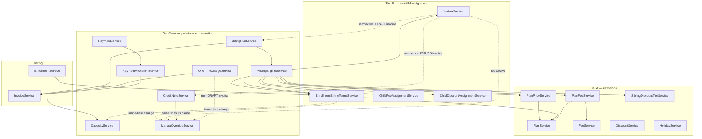

# Configuration Engine — Backend Services Design

- **Status:** Design only, not implemented. No code exists yet for anything named in this document. Revised 2026-07-29 following an architecture review — see §14 for what changed and why.
- **Date:** 2026-07-29 (original) · 2026-07-29 (architecture-review revision)
- **Builds on:** [domain-model.md](./domain-model.md) (Configuration Engine extension, approved design), [ADR-0017](./adrs/0017-configuration-before-operations.md)
- **Does not modify:** the domain model or `packages/database/prisma/schema.prisma`, both frozen inputs to this document. Every service, method, and dependency below maps onto an entity, field, or business rule already approved in those two documents. Nothing here proposes a new table, a new field, or a new business capability.
- **Scope:** the service layer sitting between the already-committed Configuration Engine database foundation and the REST controllers that will eventually expose it — i.e. the "Backend Services" phase of the Configuration Engine, following the same modules-before-frontend sequencing [ADR-0015](./adrs/0015-backend-complete-modules-prioritized-for-frontend.md) already established.

## 0. How to read this document

The codebase already has a working, proven pattern for simple entity modules (`Classroom`, `Guardian`, `Invoice`, …): a thin `XService` that resolves `tenantId`/`userId` and translates errors, delegating almost everything — including the transaction — to an `XRepository`. That pattern is kept unchanged wherever it still fits (§2 Tier A/B).

It does **not** fit the handful of rules domain-model.md itself flags as needing to "live in a small number of shared service functions, not be treated as documentation reviewers are expected to remember" (domain-model.md, Business invariants, "Implementation-phase guidance"): centralized capacity counting, idempotent `BillingRun` regeneration, and the discount/waiver floor-at-zero computation. Those become genuine cross-entity services (§2 Tier C) that several thin per-entity services depend on. This split — not "one service per controller" — is the one real architectural decision in this document; everything else is applying the existing convention to fourteen new tables.

## 1. Service boundaries

Three tiers, in increasing order of how many entities/tables a single service touches.

### Tier A — Configuration definition services (tenant-wide setup, no per-child state)

| Service | Owns |
|---|---|
| `PlanService` | `Plan` |
| `PlanPriceService` | `PlanPrice` |
| `FeeService` | `Fee` |
| `PlanFeeService` | `PlanFee` |
| `DiscountService` | `Discount` |
| `SiblingDiscountTierService` | `SiblingDiscountTier` |
| `HolidayService` | `Holiday` |

### Tier B — Per-child / per-enrollment assignment services

| Service | Owns |
|---|---|
| `EnrollmentBillingTermsService` | `EnrollmentBillingTerms` |
| `ChildFeeAssignmentService` | `ChildFeeAssignment` |
| `ChildDiscountAssignmentService` | `ChildDiscountAssignment` |
| `WaiverService` | `Waiver` |

### Tier C — Cross-cutting computation / orchestration services

| Service | Owns / computes |
|---|---|
| `CapacityService` | The centralized capacity-counting rule (no table of its own — owns one minimal, direct read against `enrollments`/`classrooms`; see §10) |
| `PricingEngineService` | Computes what an invoice's Configuration-Engine-sourced line items should be for one child + period, including the sibling-count resolution the `SiblingDiscountTier` rule depends on (no table of its own — pure computation over Tier A/B reads) |
| `BillingRunService` | `BillingRun`, orchestrates `Invoice`/`InvoiceLineItem` generation — also owns `regenerateInvoiceForChild`, the one shared primitive both its own per-child loop and `WaiverService.applyRetroactively`'s DRAFT branch call, so "recompute a DRAFT invoice's Configuration-Engine-sourced lines" is implemented exactly once |
| `PaymentService` | `Payment` (extracted from `Invoice` — see §2.1) |
| `PaymentAllocationService` | `PaymentAllocation` |
| `ManualOverrideService` | `ManualOverride` |
| `OneTimeChargeService` | No table of its own — produces `InvoiceLineItem` rows with `sourceType = ONE_TIME_CHARGE`, via `ManualOverrideService` |
| `CreditNoteService` | `CreditNote` |

### 2.1 Existing services this extends (not new — affected by the Configuration Engine)

| Existing service | What changes | Why |
|---|---|---|
| `EnrollmentService` / `EnrollmentRepository` | The inline capacity check in `EnrollmentRepository.create` (`activeCount >= classroom.capacity`, currently `status: 'ACTIVE'` only) is replaced by a call to `CapacityService.assertCapacityAvailable`, which counts `status IN (ACTIVE, SUSPENDED)`. Enrollment creation/closure gains a companion call into `EnrollmentBillingTermsService` within the *same* transaction. | domain-model.md's `SUSPENDED` addition and its explicit "one centralized capacity-counting rule, never duplicated inline" instruction; `Enrollment`↔`EnrollmentBillingTerms` lockstep creation. |
| `InvoiceService` / `InvoiceRepository` | `recordPayment`/`findPayments` move out to the new `PaymentService`/`PaymentAllocationService` — `Payment` is no longer 1:1 with `Invoice`. `addLineItem` remains DRAFT-only for `PLAN_TUITION`/`FEE`/`DISCOUNT`/`WAIVER` lines, unchanged. `InvoiceService` gains two new **composable** methods (§4, §6) so Tier C never has to reach around it into `InvoiceRepository` directly: `replaceGeneratedLines` (bulk-replaces only `sourceType ∈ {PLAN_TUITION, FEE, DISCOUNT, WAIVER}` lines and recomputes the total — the one place idempotent regeneration is implemented) and `addExceptionLineItem` (inserts a line regardless of invoice status — the one place a `ONE_TIME_CHARGE` line can bypass the DRAFT-only rule, always paired with a `ManualOverride` by its caller). Neither is a general relaxation of the DRAFT-only rule for ordinary line-item editing; both are narrow, audited exception paths. The placeholder `nextInvoiceNumber` committed in the database-foundation work stays as-is — sequential numbering was never in scope for this phase. | ADR-0017 Consequences: "`Payment`'s data shape changes materially... anchored to `Guardian`." domain-model.md: "`ONE_TIME_CHARGE` lines added after generation are left alone" by regeneration, implying they *can* exist outside DRAFT — but only through the audited exception path. Architecture review: naming these two methods explicitly closes the gap where `BillingRunService`, `WaiverService`, and `OneTimeChargeService` each had an unspecified way of writing into `Invoice`'s data, which risked either a boundary violation or three independent reimplementations of the same regeneration logic. |

## 3. Responsibilities per service

| Service | Responsibility (one sentence) |
|---|---|
| `PlanService` | CRUD + activate/deactivate for `Plan` definitions (name, billing cycle, schedule window). |
| `PlanPriceService` | Historize `Plan` pricing — open a new price period, close the previous one, resolve the price effective on a given date. |
| `FeeService` | CRUD + activate/deactivate for `Fee` definitions. |
| `PlanFeeService` | Attach/detach a `Fee` to a `Plan` and mark it mandatory or optional for that plan. |
| `DiscountService` | CRUD + activate/deactivate for reusable `Discount` rules. |
| `SiblingDiscountTierService` | Historize the tenant's sibling-count → discount-percentage table. |
| `HolidayService` | CRUD for date-specific tenant closures; no historization (a holiday is a fact about one date, not a policy that supersedes itself). |
| `EnrollmentBillingTermsService` | Own the financial terms of one `Enrollment` — plan assignment, billing guardian, custom rate, deposit — created/closed in lockstep with `Enrollment`, resolved by billing period for invoicing. |
| `ChildFeeAssignmentService` | Historize which optional `Fee`s a child has opted into, snapshotting the amount at assignment time. |
| `ChildDiscountAssignmentService` | Historize which `Discount`s are applied to a specific child, snapshotting the amount at assignment time. |
| `WaiverService` | Create/expire per-child `Waiver`s (OWNER/ADMIN-only) and drive the retroactive-application flow onto DRAFT vs. already-`ISSUED` invoices. |
| `CapacityService` | The single evaluation point for "does this classroom have room" — `status IN (ACTIVE, SUSPENDED)` — so no other module ever re-implements it. |
| `PricingEngineService` | Given a child and a billing period, compute the tuition/fee/discount/waiver line items that period should produce, applying the stacking and floor-at-zero rules. |
| `BillingRunService` | Orchestrate invoice generation/regeneration for a tenant + period across all eligible children, idempotently, per `BillingRun`. |
| `PaymentService` | Record a payment against a `Guardian` (the billing party), then trigger allocation. |
| `PaymentAllocationService` | Allocate a payment's amount across a guardian's outstanding invoices, oldest-first, across all their children; expose the guardian's computed available credit. |
| `ManualOverrideService` | The single audit-trail writer for every exception path — waiver, one-time charge, discount override, immediate plan change, withdrawal-notice waiver, attendance exception. |
| `OneTimeChargeService` | Add an ad hoc charge to an invoice (draft or already-issued), auditing the exception when it touches a non-draft invoice. |
| `CreditNoteService` | Create, apply, and refund money owed back to a guardian, without ever mutating the original invoice. |

## 4. Public methods per service

Signatures are framework-agnostic TypeScript — no NestJS decorators, no Prisma types leaking through. `tx` parameters are the transaction handle discussed in §6; a method that takes one is meant to be composed inside a caller's transaction, not to open its own.

```ts
// ---- Tier A ----

interface PlanService {
  create(tenantId: string, dto: CreatePlanInput, actorId: string): Promise<Plan>;
  findAll(tenantId: string, query: PlanQuery): Promise<Paginated<Plan>>;
  findOne(tenantId: string, id: string): Promise<Plan>;
  update(tenantId: string, id: string, dto: UpdatePlanInput, actorId: string): Promise<Plan>;
  setActive(tenantId: string, id: string, isActive: boolean, actorId: string): Promise<Plan>;
}

interface PlanPriceService {
  /** Closes the current open-ended price (effectiveTo = newEffectiveFrom - 1 day) and opens a new one, in one transaction. */
  setPrice(tenantId: string, planId: string, dto: { amount: string; effectiveFrom: string }, actorId: string): Promise<PlanPrice>;
  findHistory(tenantId: string, planId: string, query: PageQuery): Promise<Paginated<PlanPrice>>;
  /** Resolves the price effective on asOfDate (defaults to today) — the read path PricingEngineService depends on. */
  findEffective(tenantId: string, planId: string, asOfDate: string, tx?: Tx): Promise<PlanPrice>;
}

interface FeeService {
  create(tenantId: string, dto: CreateFeeInput, actorId: string): Promise<Fee>;
  findAll(tenantId: string, query: FeeQuery): Promise<Paginated<Fee>>;
  findOne(tenantId: string, id: string): Promise<Fee>;
  update(tenantId: string, id: string, dto: UpdateFeeInput, actorId: string): Promise<Fee>;
  setActive(tenantId: string, id: string, isActive: boolean, actorId: string): Promise<Fee>;
}

interface PlanFeeService {
  attach(tenantId: string, planId: string, feeId: string, isMandatory: boolean, actorId: string): Promise<PlanFee>;
  detach(tenantId: string, planId: string, feeId: string, actorId: string): Promise<void>;
  findForPlan(tenantId: string, planId: string, tx?: Tx): Promise<PlanFee[]>;
}

interface DiscountService {
  create(tenantId: string, dto: CreateDiscountInput, actorId: string): Promise<Discount>; // OWNER/ADMIN
  findAll(tenantId: string, query: DiscountQuery): Promise<Paginated<Discount>>;
  findOne(tenantId: string, id: string): Promise<Discount>;
  update(tenantId: string, id: string, dto: UpdateDiscountInput, actorId: string): Promise<Discount>; // OWNER/ADMIN
  setActive(tenantId: string, id: string, isActive: boolean, actorId: string): Promise<Discount>; // OWNER/ADMIN
}

interface SiblingDiscountTierService {
  setTier(tenantId: string, dto: { siblingCountThreshold: number; discountPercentage: string; effectiveFrom: string }, actorId: string): Promise<SiblingDiscountTier>;
  findAll(tenantId: string, query: PageQuery): Promise<Paginated<SiblingDiscountTier>>;
  /** All tiers effective on asOfDate, ascending by threshold — the read path SiblingDiscount resolution depends on. */
  findEffective(tenantId: string, asOfDate: string, tx?: Tx): Promise<SiblingDiscountTier[]>;
}

interface HolidayService {
  create(tenantId: string, dto: CreateHolidayInput, actorId: string): Promise<Holiday>;
  findAll(tenantId: string, query: HolidayQuery): Promise<Paginated<Holiday>>;
  findOne(tenantId: string, id: string): Promise<Holiday>;
  update(tenantId: string, id: string, dto: UpdateHolidayInput, actorId: string): Promise<Holiday>;
  remove(tenantId: string, id: string, actorId: string): Promise<void>;
}

// ---- Tier B ----

interface EnrollmentBillingTermsService {
  /** Called by EnrollmentService inside its own create transaction — never opens one itself. */
  openWithEnrollment(tx: Tx, tenantId: string, enrollmentId: string, dto: OpenBillingTermsInput, actorId: string): Promise<EnrollmentBillingTerms>;
  /** Called by EnrollmentService inside its own close transaction. */
  closeWithEnrollment(tx: Tx, tenantId: string, enrollmentId: string, effectiveTo: string, actorId: string): Promise<void>;
  /** Plan/rate change. immediate=true requires OWNER/ADMIN and records a PLAN_CHANGE_IMMEDIATE ManualOverride. */
  changeTerms(tenantId: string, enrollmentId: string, dto: ChangeBillingTermsInput, actorId: string): Promise<EnrollmentBillingTerms>;
  findCurrent(tenantId: string, enrollmentId: string): Promise<EnrollmentBillingTerms>;
  /** Period-overlap resolution, not "currently open" — the rule BillingRun regeneration depends on. */
  findEffectiveForPeriod(tenantId: string, enrollmentId: string, periodStart: string, periodEnd: string, tx?: Tx): Promise<EnrollmentBillingTerms | null>;
  /**
   * Counts distinct children whose Enrollment status IN (ACTIVE, SUSPENDED) overlaps the
   * period and whose EnrollmentBillingTerms.billingGuardianId matches billingGuardianId —
   * the read PricingEngineService's SiblingDiscountTier resolution depends on. Named here,
   * not on a new service, because this module already owns billing-guardian matching.
   */
  countEligibleSiblings(tenantId: string, billingGuardianId: string, periodStart: string, periodEnd: string, tx?: Tx): Promise<number>;
}

interface ChildFeeAssignmentService {
  assign(tenantId: string, childId: string, feeId: string, effectiveFrom: string, actorId: string): Promise<ChildFeeAssignment>;
  unassign(tenantId: string, childId: string, feeId: string, effectiveTo: string, actorId: string): Promise<void>;
  findForChild(tenantId: string, childId: string, query: PageQuery): Promise<Paginated<ChildFeeAssignment>>;
  findEffectiveForPeriod(tenantId: string, childId: string, periodStart: string, periodEnd: string, tx?: Tx): Promise<ChildFeeAssignment[]>;
}

interface ChildDiscountAssignmentService {
  assign(tenantId: string, childId: string, discountId: string, dto: { effectiveFrom: string; effectiveTo?: string }, actorId: string): Promise<ChildDiscountAssignment>;
  expire(tenantId: string, childId: string, discountId: string, effectiveTo: string, actorId: string): Promise<void>;
  findForChild(tenantId: string, childId: string, query: PageQuery): Promise<Paginated<ChildDiscountAssignment>>;
  findEffectiveForPeriod(tenantId: string, childId: string, periodStart: string, periodEnd: string, tx?: Tx): Promise<ChildDiscountAssignment[]>;
}

interface WaiverService {
  create(tenantId: string, childId: string, dto: CreateWaiverInput, approvedBy: string): Promise<Waiver>; // OWNER/ADMIN
  update(tenantId: string, id: string, dto: UpdateWaiverInput, actorId: string): Promise<Waiver>; // OWNER/ADMIN
  findForChild(tenantId: string, childId: string, query: PageQuery): Promise<Paginated<Waiver>>;
  findEffectiveForPeriod(tenantId: string, childId: string, periodStart: string, periodEnd: string, tx?: Tx): Promise<Waiver[]>;
  /**
   * DRAFT invoice: calls BillingRunService.regenerateInvoiceForChild within this method's own
   * transaction — the same shared primitive BillingRun's per-child loop uses, never a second
   * implementation of "recompute a DRAFT invoice's lines." ISSUED invoice: opens one transaction
   * and passes its tx into both CreditNoteService.create and ManualOverrideService.record, so
   * the credit note and its audit record commit together.
   */
  applyRetroactively(tenantId: string, waiverId: string, targetInvoiceId: string, actorId: string): Promise<void>;
}

// ---- Tier C ----

interface CapacityService {
  /**
   * Owns one minimal, direct read against enrollments/classrooms (via PrismaService, or a
   * small dedicated repository of its own) — deliberately NOT routed through
   * EnrollmentRepository/EnrollmentModule. EnrollmentService already depends on
   * CapacityService for validation; if CapacityService depended back on EnrollmentModule for
   * its read, the two modules would import each other. See §10.
   */
  countOccupiedSeats(tx: Tx, tenantId: string, classroomId: string): Promise<number>;
  /** Throws CapacityExceededError. Never opens its own transaction — always composed inside the caller's. */
  assertCapacityAvailable(tx: Tx, tenantId: string, classroomId: string): Promise<void>;
}

interface PricingEngineService {
  /**
   * Pure(ish) computation: reads Tier A/B state as of the given period — including, via
   * EnrollmentBillingTermsService.countEligibleSiblings + SiblingDiscountTierService.findEffective,
   * which SiblingDiscountTier applies — applies stacking + floor-at-zero, returns drafts, writes
   * nothing itself. tx is optional: omitted for a standalone read (e.g. a future price preview),
   * supplied by BillingRunService when generating so the computation and the invoice write it
   * feeds are consistent with each other.
   */
  computeChargesForPeriod(tenantId: string, childId: string, periodStart: string, periodEnd: string, tx?: Tx): Promise<LineItemDraft[]>;
}

interface BillingRunService {
  /** Idempotent: re-running for an existing (tenantId, periodStart, periodEnd) updates DRAFT invoices in place. */
  generateForPeriod(tenantId: string, periodStart: string, periodEnd: string, triggeredBy: string): Promise<BillingRun>;
  findHistory(tenantId: string, query: PageQuery): Promise<Paginated<BillingRun>>;
  findOne(tenantId: string, id: string): Promise<BillingRun>;
  /**
   * The single shared regeneration primitive: computes charges via PricingEngineService, then
   * calls InvoiceService.replaceGeneratedLines. Used internally by generateForPeriod's per-child
   * loop AND by WaiverService.applyRetroactively's DRAFT branch — never opens its own
   * transaction, always composed inside the caller's.
   */
  regenerateInvoiceForChild(tx: Tx, tenantId: string, childId: string, periodStart: string, periodEnd: string, actorId: string): Promise<Invoice>;
}

interface PaymentService {
  record(tenantId: string, guardianId: string, dto: RecordPaymentInput, actorId: string): Promise<Payment>;
  findForGuardian(tenantId: string, guardianId: string, query: PageQuery): Promise<Paginated<Payment>>;
}

interface PaymentAllocationService {
  /** Oldest-invoice-first across all of the guardian's children. Composed inside PaymentService.record's transaction. */
  allocate(tx: Tx, tenantId: string, paymentId: string, guardianId: string, amount: string, actorId: string): Promise<PaymentAllocation[]>;
  getAvailableCredit(tenantId: string, guardianId: string): Promise<string>;
  /**
   * Sweeps existing unallocated credit onto a guardian's currently-outstanding invoices. Not
   * required by domain-model.md (credit is described as computed, never as something that must
   * auto-apply) and NOT wired to fire automatically after InvoiceService.issue — that automatic
   * edge was the source of a real circular dependency between this service and InvoiceService
   * (see §5, §14). Exposed as an explicit, separately-invoked action only; nothing calls it yet.
   */
  reallocateCredit(tenantId: string, guardianId: string, actorId: string): Promise<PaymentAllocation[]>;
}

interface ManualOverrideService {
  /** Never opens its own transaction — the row must commit atomically with whatever it audits. */
  record(tx: Tx, tenantId: string, dto: RecordOverrideInput, actorId: string): Promise<ManualOverride>;
  findForEntity(tenantId: string, relatedEntityType: string, relatedEntityId: string, query: PageQuery): Promise<Paginated<ManualOverride>>;
}

interface OneTimeChargeService {
  /** Composes InvoiceService.addExceptionLineItem with ManualOverrideService.record (only when the invoice is not DRAFT) in one transaction. */
  add(tenantId: string, invoiceId: string, dto: AddOneTimeChargeInput, actorId: string): Promise<InvoiceLineItem>;
}

interface CreditNoteService {
  create(tenantId: string, dto: CreateCreditNoteInput, actorId: string): Promise<CreditNote>; // OWNER/ADMIN
  applyToInvoice(tenantId: string, creditNoteId: string, targetInvoiceId: string, actorId: string): Promise<CreditNote>;
  refund(tenantId: string, creditNoteId: string, refundedVia: string, actorId: string): Promise<CreditNote>;
  findForGuardian(tenantId: string, guardianId: string, query: PageQuery): Promise<Paginated<CreditNote>>;
}

// ---- Extensions to the existing InvoiceService (see §2.1) ----

interface InvoiceServiceExtensions {
  /**
   * Composable — replaces only sourceType ∈ {PLAN_TUITION, FEE, DISCOUNT, WAIVER} lines with
   * drafts, leaves ONE_TIME_CHARGE lines untouched, recomputes the total. The one place
   * idempotent regeneration is implemented — called only by BillingRunService.regenerateInvoiceForChild.
   * Never opens its own transaction.
   */
  replaceGeneratedLines(tx: Tx, tenantId: string, invoiceId: string, drafts: LineItemDraft[], actorId: string): Promise<Invoice>;
  /**
   * Composable — inserts one InvoiceLineItem regardless of invoice status (the DRAFT-only rule
   * on the existing addLineItem is deliberately left unchanged; this is a separate, narrower
   * path). Called only by OneTimeChargeService.add. Never opens its own transaction.
   */
  addExceptionLineItem(tx: Tx, tenantId: string, invoiceId: string, dto: AddExceptionLineItemInput, actorId: string): Promise<InvoiceLineItem>;
}
```

## 5. Dependencies between services



Notes on the diagram:

- **Solid arrows** are "always calls, every time." **Dashed arrows** are conditional — they only fire on the exception path (an immediate plan change, a retroactive waiver, a one-time charge against a non-draft invoice).
- `CapacityService` and `ManualOverrideService` have no incoming Tier A/B dependency of their own — everything below them stays framework-agnostic, pure logic over data the caller already has locked.
- Nothing in Tier C depends on a controller or DTO type. The only NestJS-specific surface in this whole design is the controller layer itself (§10).
- **No cycle exists**, and this is now verified rather than asserted: Tier A → Tier B → Tier C → existing services, strictly one direction, plus the dashed exception edges which are still one-directional (Tier B → Tier C, never back). Two edges that *would* have closed a cycle were deliberately removed rather than drawn — see §14: `PaymentAllocationService` no longer has any edge back into `InvoiceService` (the automatic post-`issue()` credit sweep was cut), and `CapacityService` has no edge into `EnrollmentService`/`EnrollmentRepository` at all (it owns its own minimal read instead, per §10) even though the diagram's flat service-to-service view would never have shown that latent module-level cycle in the first place — it only existed in §10's prose, which is why it's flagged here explicitly.

## 6. Transaction boundaries

Two kinds of service method, distinguished consistently across every service above:

1. **Entry-point methods** (the majority) open their own transaction, exactly like every existing repository does today via `withTenantContext` — one HTTP request, one transaction, commit or roll back as a unit.
2. **Composable methods** (marked `tx: Tx` as their first parameter in §4) never open a transaction. They are designed to be called *inside* another service's already-open transaction, because their write must be atomic with whatever caused it. This is not a new pattern — it's the same shape `InvoiceRepository.recomputeTotal`/`lockInvoice` already use as private helpers *within* one repository; this design applies it *across* service boundaries, which the existing codebase has never needed to do before Configuration Engine's cross-entity rules.

Concretely:

| Operation | Transaction shape |
|---|---|
| `PlanPriceService.setPrice` / `SiblingDiscountTierService.setTier` | One transaction: close the current open-ended row, insert the new one — same historization shape `Enrollment` already uses. |
| `EnrollmentBillingTermsService.openWithEnrollment` / `closeWithEnrollment` | No transaction of their own. `EnrollmentService.create`/close opens the transaction and passes its `tx` in, so `Enrollment` + `EnrollmentBillingTerms` commit or fail together — this is what "created and closed in lockstep, never independently" means at the transaction level, not just the data-modeling level. |
| `CapacityService.assertCapacityAvailable` | No transaction of its own, ever. It must see the same locked snapshot its caller (`EnrollmentService.create` or `EnrollmentBillingTermsService.changeTerms`) is already holding — opening a second transaction here would race against the very lock the caller took. Its read is a direct query `CapacityService` owns itself (§10), not a call into `EnrollmentRepository`, so composing it into the caller's `tx` never risks pulling in `EnrollmentModule`'s own transaction boundary. |
| `PricingEngineService.computeChargesForPeriod` | `tx` is optional, and always the last parameter (matching every other Tier A/B `find*(..., tx?)` method). Called read-only (own short transaction) if something ever needs a standalone price preview; called with `BillingRunService`'s `tx` when generating, so the computation and the invoice write it feeds are consistent with each other. |
| `BillingRunService.generateForPeriod` | **Not** one transaction for the whole tenant. One short transaction creates/finds the `BillingRun` row (relying on the `UNIQUE(tenantId, periodStart, periodEnd)` constraint for idempotency — see §7). Then **each child's invoice regeneration is its own separate transaction**, calling `regenerateInvoiceForChild` (below) with that transaction's `tx`. A failure on one child marks that child's regeneration failed and continues to the next; `BillingRun.status` becomes `PARTIAL_FAILURE` rather than rolling back everyone else's already-generated invoices. This is the direct consequence of ADR-0017's "staggered, queued-per-tenant... never a single synchronous batch" requirement — a single all-tenant-children transaction would be exactly the failure mode that requirement rejects, just at a smaller (one-tenant) scale. |
| `BillingRunService.regenerateInvoiceForChild` → `InvoiceService.replaceGeneratedLines` | No transaction of their own, ever — both composable, both always run inside a caller-supplied `tx`. `replaceGeneratedLines` locks the target invoice the same way `InvoiceRepository.lockInvoice` already does before replacing lines and recomputing the total. This is the one code path either `BillingRunService.generateForPeriod`'s per-child loop or `WaiverService.applyRetroactively`'s DRAFT branch ever calls to regenerate an invoice — never two independent implementations of the same operation. |
| `PaymentService.record` → `PaymentAllocationService.allocate` | One transaction. Locks each candidate outstanding invoice, oldest-first, in the order it will write to them — same `FOR UPDATE` discipline as `InvoiceRepository.lockInvoice`, extended to a list instead of one row. |
| `PaymentAllocationService.reallocateCredit` | Its own transaction, opened only when something explicitly calls it — never triggered as a side effect of another service's transaction (in particular, not from `InvoiceService.issue`; see §5, §14). |
| `ManualOverrideService.record` | No transaction of its own, ever — always composed into the caller's. A `ManualOverride` row that committed without the change it describes (or vice versa) would make the audit trail actively misleading, worse than not having one. |
| `WaiverService.applyRetroactively` (DRAFT case) | One transaction, opened by `WaiverService`, passed as `tx` into `BillingRunService.regenerateInvoiceForChild` — the same shared regeneration primitive `BillingRunService.generateForPeriod` uses, not a second implementation. |
| `WaiverService.applyRetroactively` (ISSUED case) | One transaction, opened by `WaiverService`, passed as `tx` into both `CreditNoteService.create` and `ManualOverrideService.record` — the credit note and its audit record must commit together. |
| `OneTimeChargeService.add` → `InvoiceService.addExceptionLineItem` (non-DRAFT invoice) | One transaction: lock the invoice, insert the line via `addExceptionLineItem`, recompute the total, record the `ManualOverride` — same "everything or nothing" shape as the ISSUED waiver case above. |

## 7. Validation responsibilities

Three layers, matching how the existing modules already split this (DTO/`class-validator` → service/business-rule → DB constraint), extended with what Tier C actually needs:

**DTO layer (shape, always enforced before a service method ever runs):**
- Required fields, types, string lengths, decimal formatting — same as every existing `CreateXDto`.
- Enum membership: `Plan.billingCycle`, `Fee.type`, `Discount.type`/`scope`, `Waiver.type`/`reasonCode`, `Holiday.type`, `EnrollmentBillingTerms.depositRefundPolicy`, `ManualOverride.overrideType`/`reasonCode`, `InvoiceLineItem.chargeCategory`, `CreditNote.reasonCode`/`status` — all fixed string vocabularies per domain-model.md, validated the same way existing DTOs validate `Invoice.status`/`PaymentMethod` today.
- Conditional-required fields expressible without a DB read: `reasonNote` required when `reasonCode = OTHER` (`ManualOverride`, `Waiver`... wherever `OTHER` appears), `Waiver.effectiveTo` required unless `reviewAnnually = true`, `CreditNote.appliedToInvoiceId` required when setting `status = APPLIED`, `refundedVia` required when setting `status = REFUNDED`. `class-validator`'s `@ValidateIf` is the existing tool for this — no new mechanism needed.

**Service layer (business rules that need DB state, cannot be checked from the DTO alone):**
- `CapacityService.assertCapacityAvailable` — needs the current occupied-seat count.
- `PricingEngineService` — the stacking order (stackable `Discount`s + best exclusive, `SiblingDiscountTier` always additive, `Waiver` last) and the floor-at-zero rule are *computation* logic, not a single boolean check; they live entirely in this service so no other code path can reintroduce a slightly-different version of the same math. The sibling count that resolves *which* `SiblingDiscountTier` applies has one owner too: `EnrollmentBillingTermsService.countEligibleSiblings` (§4) — `PricingEngineService` calls it rather than querying `Enrollment`/`EnrollmentBillingTerms` itself, so the "`ACTIVE`/`SUSPENDED`, period-overlapping, same `billing_guardian_id`" definition of a sibling is implemented exactly once.
- `BillingRunService.regenerateInvoiceForChild` / `InvoiceService.replaceGeneratedLines` — idempotent regeneration (only `PLAN_TUITION`/`FEE`/`DISCOUNT`/`WAIVER`-sourced lines are touched, `ONE_TIME_CHARGE` lines are always left alone) is implemented in exactly this one composable pair, called by both `BillingRunService.generateForPeriod`'s per-child loop and `WaiverService.applyRetroactively`'s DRAFT branch.
- `Plan`/`Fee`/`Discount` `isActive` gating — an assignment service refuses to create a new `ChildFeeAssignment`/`ChildDiscountAssignment`/`EnrollmentBillingTerms.planId` pointing at an inactive definition, per the soft-delete cascade policy ("only *new* assignment against an inactive Plan/Fee/Discount is blocked").
- `EnrollmentBillingTermsService.changeTerms` — enforces the next-cycle-by-default rule; a mid-cycle `effectiveFrom` is only reachable via the `immediate` path, which itself requires the caller to be OWNER/ADMIN and produces a `ManualOverride`.
- `BillingRunService` — period-overlap resolution (never "whichever record is currently open") when calling `EnrollmentBillingTermsService.findEffectiveForPeriod` / `PlanPriceService.findEffective` / `SiblingDiscountTierService.findEffective`.
- `CreditNoteService` — status-transition guards (`OPEN → APPLIED`, `OPEN → REFUNDED`), same shape as `InvoiceConflictError`'s existing status-guard checks.
- `WaiverService.applyRetroactively` — branches on the target invoice's status (`DRAFT` → regenerate in place; anything issued → `CreditNote` + `ManualOverride`), per the domain model's explicit description of how the two mechanisms relate.

**Database layer (final backstop, never the primary validation path):**
- The existing tenant-isolation RLS policy pattern, extended to every new table, exactly as domain-model.md's RLS implications section specifies — a backstop to the explicit `tenantId` filtering every repository already does, not a substitute for it.
- Partial unique indexes as safety nets for invariants the service layer is already responsible for maintaining correctly: at most one open-ended `PlanPrice`/`SiblingDiscountTier`, exactly one `EnrollmentBillingTerms` per `Enrollment`.
- One exception where the DB constraint *is* the primary mechanism, not just a backstop: `UNIQUE(tenantId, periodStart, periodEnd)` on `BillingRun` is what `BillingRunService.generateForPeriod` relies on for idempotency under concurrent triggering (e.g. a manual re-run racing a scheduled one) — the service finds-or-creates against that constraint rather than checking-then-inserting, the same TOCTOU-safe pattern a `find-or-create` against a unique index always provides.

## 8. Error handling strategy

Extends the existing two-error-family convention (`EntityNotFoundError` → 404 via `translateNotFound`; a per-module `XConflictError` → 409 via each service's own `translateError`) rather than replacing it:

- **`EntityNotFoundError`** (shared, already exists) — used unchanged by every new repository for missing `Plan`/`Fee`/`Discount`/`Waiver`/etc. lookups. No new not-found error type is needed anywhere in this design.
- **Per-entity conflict errors**, following the exact naming convention `InvoiceConflictError` already established, for status-guard violations owned by one Tier A/B entity: `PlanPriceConflictError` (e.g. `effectiveFrom` before the current open period's start), `WaiverConflictError` (e.g. missing `effectiveTo`/`reviewAnnually`), `CreditNoteConflictError` (invalid status transition), `EnrollmentBillingTermsConflictError` (mid-cycle change attempted without `immediate`).
- **Shared cross-cutting errors** for the Tier C services, since these aren't owned by a single entity and would otherwise get reinvented slightly differently by every caller:
  - `CapacityExceededError` — thrown by `CapacityService`, caught identically whether it originated from `EnrollmentService.create` or `EnrollmentBillingTermsService.changeTerms`.
  - `BillingRunConflictError` — e.g. attempting to regenerate a period whose `BillingRun` is already fully `ISSUED` (nothing left to regenerate) — never thrown for the ordinary idempotent-rerun case, which is a normal update-in-place, not an error.
  - `PaymentAllocationError` — e.g. allocating more than a payment's recorded amount (should be structurally unreachable given `PaymentAllocationService` computes the split itself, but kept as the defensive boundary the way `InvoiceConflictError('This payment would exceed the outstanding balance')` already guards the equivalent case today).
- All of the above translate to `ConflictException` (409); `EntityNotFoundError` always translates to `NotFoundException` (404) — same HTTP mapping the existing modules use, no new status codes introduced.
- `ManualOverrideService.record` deliberately has **no** dedicated error type of its own for "validation failed" — by the time it's called, its caller has already validated the reason code / related entity per §7; `ManualOverrideService` only ever fails on infrastructure grounds (transaction rollback from whatever it's composed into), which is not a new error type to design for.

## 9. Authorization boundaries

Same mechanism throughout — `@Roles(...)` + the existing `RolesGuard`/`AuthorizationService`, no new authorization primitive. The table below states the intended role gate per operation family; it follows the tiering domain-model.md already states explicitly (`Discount`/`Waiver` creation "OWNER/ADMIN-only, the same sensitivity tier") and extends the same tier, by direct analogy, to the rest of the Configuration Engine's financially-defining actions — consistent with [ADR-0011](./adrs/0011-narrower-access-for-sensitive-modules.md)'s existing narrower-access-for-sensitive-modules precedent (the same reasoning that already gates `StaffPayroll`).

| Area | Write | Read |
|---|---|---|
| `Plan` / `PlanPrice` / `Fee` / `PlanFee` / `SiblingDiscountTier` / `Holiday` | OWNER, ADMIN | Any authenticated tenant member (STAFF needs to see plan/fee names to enroll a child) |
| `Discount` | OWNER, ADMIN (explicit in domain-model.md) | Any authenticated tenant member |
| `ChildFeeAssignment` / `ChildDiscountAssignment` | OWNER, ADMIN | Any authenticated tenant member |
| `EnrollmentBillingTerms` (plan, custom rate, deposit) | OWNER, ADMIN | OWNER, ADMIN — carries `customRateAmount`/`depositAmount`, same sensitivity class as `StaffPayroll` under ADR-0011, not general tenant-member-readable |
| `Waiver` | OWNER, ADMIN (explicit in domain-model.md) | OWNER, ADMIN — `reasonCode` values (HARDSHIP, SCHOLARSHIP) are sensitive family information |
| `BillingRun` (trigger + history) | OWNER, ADMIN | OWNER, ADMIN |
| `Payment` (record) | OWNER, ADMIN, STAFF — matches the existing `InvoiceController.recordPayment` tier (front-desk collects payment) | Any authenticated tenant member — matches existing `findPayments`, no `@Roles` today |
| `PaymentAllocation` / available-credit read | System-internal (never a direct write endpoint — always a side effect of `PaymentService.record`) | Any authenticated tenant member |
| `ManualOverride` (record + read) | OWNER, ADMIN (explicit in domain-model.md: "OWNER/ADMIN-only") | OWNER, ADMIN — this is the audit trail of every financial exception |
| `OneTimeChargeService.add` | OWNER, ADMIN, STAFF — `LATE_PICKUP` is plausibly a front-desk action, matching `Payment`'s tier | Any authenticated tenant member — it's an ordinary `InvoiceLineItem`, same as existing line items |
| `CreditNote` (create/apply/refund) | OWNER, ADMIN (explicit in domain-model.md) | OWNER, ADMIN |

Every write above continues to also pass through `JwtAuthGuard` first (must be authenticated at all) and RLS second (tenant isolation, backstop) — this table only states the additional role gate `RolesGuard` enforces on top of those two, unchanged mechanisms.

## 10. How services interact with repositories

Unchanged from the existing convention, extended to the new tiers:

- **Tier A/B services each own exactly one repository**, one-to-one, exactly like `InvoiceService` ↔ `InvoiceRepository` today. The repository is where the Prisma calls, `withTenantContext` transaction, and `findOrThrow` lookups actually live; the service resolves `tenantId`/`actorId` from `CurrentTenantProvider`/`CurrentUserProvider` and translates errors — no business logic duplicated between the two.
- **Tier C services mostly do not get their own repository — with one deliberate exception.** `PricingEngineService` reads through the Tier A/B services' `find*` methods (which is why those methods accept an optional `tx` — see §4/§6) rather than querying Prisma directly, so the same period-resolution/effective-row logic is never implemented twice. `BillingRunService` has its own thin `BillingRunRepository`, since `BillingRun` itself is a real row it owns; when it needs to *write* into `Invoice`'s data (via `regenerateInvoiceForChild`), it calls `InvoiceService.replaceGeneratedLines` — a new composable method on `InvoiceService` itself (§4, §2.1) — never `InvoiceRepository` directly. `OneTimeChargeService` follows the same shape through `InvoiceService.addExceptionLineItem`.
  The one exception is `CapacityService`: it owns a small, direct read of its own against `enrollments`/`classrooms` (via `PrismaService`, or a minimal dedicated repository), rather than depending on `EnrollmentRepository`/`EnrollmentModule`. This is deliberate, not an inconsistency — `EnrollmentService` already depends on `CapacityService` for validation (§5), so `CapacityService` depending back on `EnrollmentModule` for its read would make the two modules import each other. `CapacityService`'s entire reason to exist is to be *the* centralized query for one specific question ("does this classroom have room"), which is a good fit for owning that one query directly rather than borrowing `EnrollmentRepository`'s broader, `findOrThrow`-wrapped business logic built for a different purpose.
- **Composable Tier C methods accept the caller's `tx`** (§6) precisely so they can call into a repository using the *same* transaction client the caller already opened — Prisma's `tx` handle is what's threaded through, never a second connection or a nested transaction.
- No service ever calls another module's repository directly, only its service's public methods (or a composable method explicitly designed to be called with an external `tx`) — the dependency graph in §5 is a service-to-service graph, not a service-to-repository one, for exactly this reason: it keeps each repository's Prisma/RLS/locking details private to its own module, matching how `InvoiceRepository`'s `lockInvoice`/`recomputeTotal` are already `private` methods no other module reaches into today.

## 11. How services support the existing REST API plan

The existing convention — nested resources under their parent when the child has no independent lifecycle (`invoices/:id/line-items`, `invoices/:id/payments`), paginated list endpoints via `ApiPaginatedResponse`, `@Roles(...)` per handler, Swagger `@ApiOperation`/`@ApiResponse` on every route, `JwtAuthGuard` + `RolesGuard` applied at the controller level — carries over unchanged. Proposed resource shape, one controller per Tier A/B/C service (mirroring one-service-per-module):

| Resource | Backed by | Notes |
|---|---|---|
| `/plans`, `/plans/:id` | `PlanService` | Standard CRUD, matches `/classrooms` shape |
| `/plans/:planId/prices` | `PlanPriceService` | Nested — a price has no lifecycle independent of its plan, same reasoning as invoice line items |
| `/fees`, `/fees/:id` | `FeeService` | Standard CRUD |
| `/plans/:planId/fees` | `PlanFeeService` | Nested attach/detach |
| `/discounts`, `/discounts/:id` | `DiscountService` | Standard CRUD |
| `/sibling-discount-tiers` | `SiblingDiscountTierService` | Tenant-singleton-ish list, no `:id` detail route needed beyond list + set |
| `/holidays`, `/holidays/:id` | `HolidayService` | Standard CRUD |
| `/children/:childId/fee-assignments` | `ChildFeeAssignmentService` | Nested under `Child`, same shape as `child-guardian` |
| `/children/:childId/discount-assignments` | `ChildDiscountAssignmentService` | Nested under `Child` |
| `/children/:childId/waivers` | `WaiverService` | Nested under `Child` |
| `/enrollments/:enrollmentId/billing-terms` | `EnrollmentBillingTermsService` | Nested under `Enrollment` — 1:1, matches the entity relationship exactly |
| `/billing-runs`, `/billing-runs/:id` | `BillingRunService` | `POST /billing-runs` triggers `generateForPeriod`; this is also the seam where a future scheduler/queue calls the same service method instead of a human — the controller and the scheduled job both just call `BillingRunService.generateForPeriod`, nothing duplicated |
| `/guardians/:guardianId/payments` | `PaymentService` | Moves off `/invoices/:id/payments` — payments are guardian-anchored now, not invoice-anchored; `/invoices/:id/payments` becomes a read-only view joining through `PaymentAllocation` if still wanted for the invoice-detail screen |
| `/guardians/:guardianId/credit` | `PaymentAllocationService.getAvailableCredit` | Read-only, computed |
| `/invoices/:invoiceId/one-time-charges` | `OneTimeChargeService` | Nested, parallel to the existing `/invoices/:id/line-items` |
| `/invoices/:invoiceId/credit-notes`, `/guardians/:guardianId/credit-notes` | `CreditNoteService` | Both listing angles are useful (per-invoice for invoice detail, per-guardian for account statement) — same underlying service, two read methods |
| `/manual-overrides?relatedEntityType=&relatedEntityId=` | `ManualOverrideService.findForEntity` | Read-only audit view, no create route — every write happens as a side effect of the action it's auditing, never directly |

No new controller conventions are introduced — every route above slots into the existing `@Controller` + `@UseGuards(JwtAuthGuard, RolesGuard)` + `@Roles(...)` + DTO + `ApiPaginatedResponse` pattern already proven across `enrollment`, `child`, `guardian`, `staff`, and `invoice`.

## 12. Explicitly out of scope

Carried forward from ADR-0017 and domain-model.md, restated here so this design doesn't quietly redecide them:

- **Job-queue/scheduling infrastructure for `BillingRun`.** `BillingRunService.generateForPeriod` is the complete service-layer entry point; *what* calls it on a staggered per-tenant schedule (cron, queue worker, manual trigger) is an infrastructure decision for the implementation phase, not a service-design one — the same seam in §11 that lets a human `POST` and a scheduler call the identical method.
- **The multi-branch sibling/allocation-scope question** domain-model.md flags as an open question — this design's `PaymentAllocationService`/sibling-count logic is tenant-scoped throughout, exactly as today's approved model is, and does not attempt to pre-answer the future per-branch question.
- **`CreditNoteAllocation`** (splitting one credit note across multiple invoices) — domain-model.md names this as a known, accepted gap, not part of the current design; `CreditNoteService.applyToInvoice` targets exactly one invoice, matching the schema's single `appliedToInvoiceId` FK.
- **A price/charge preview endpoint.** `PricingEngineService.computeChargesForPeriod` is written as a pure, reusable computation specifically so a future preview feature is cheap to add — but no such endpoint is being proposed now; that would be a new product capability outside this task's scope.

## 13. Recommended implementation sequence

Not a commitment made by this document, just the order the dependency graph in §5 implies is buildable-and-testable incrementally, for discussion before the first service is implemented:

1. **Tier A, leaf-first:** `PlanService` → `PlanPriceService` → `FeeService` → `PlanFeeService` → `DiscountService` → `SiblingDiscountTierService` → `HolidayService`. No cross-service dependencies; each is testable in isolation the same way `ClassroomService` already is.
2. **`CapacityService`**, extracted from `EnrollmentRepository`'s existing inline check, given its own minimal direct read (§10) rather than a dependency on `EnrollmentRepository`, with `EnrollmentRepository` updated to call it. Small, isolated, immediately valuable independent of everything else in this list.
3. **`EnrollmentBillingTermsService`**, wired into `EnrollmentService`'s existing create/close transaction. This is the riskiest single step (touches an already-shipped, working module) and worth its own careful review pass.
4. **Tier B assignment services:** `ChildFeeAssignmentService`, `ChildDiscountAssignmentService`, `WaiverService` (create/expire only — `applyRetroactively` deferred to step 6).
5. **`PricingEngineService`**, buildable and unit-testable once steps 1–4 exist, since it only *reads* through them.
6. **`BillingRunService`**, which is also where `InvoiceService.replaceGeneratedLines` and `regenerateInvoiceForChild` get built (§4, §2.1) — then `WaiverService.applyRetroactively`'s DRAFT branch, which depends on `regenerateInvoiceForChild` already existing. `InvoiceService.addExceptionLineItem`, `PaymentService`/`PaymentAllocationService`/`ManualOverrideService`/`CreditNoteService`/`OneTimeChargeService`, and `WaiverService.applyRetroactively`'s ISSUED branch form the final group, since they're the ones with dashed (exception-path) dependencies on each other in §5's diagram. `PaymentAllocationService.reallocateCredit` has no caller anywhere in this design (§4) — build it only if/when something is actually going to invoke it.

## 14. Architecture review corrections (2026-07-29)

A full architecture review of this document — Single Responsibility, service boundaries, circular dependencies, transaction boundaries, repository responsibilities, business-rule ownership, testability, maintainability, duplicated logic, over-engineering — found five issues serious enough to fix before implementation. All five are corrected above; this section records what changed and why, so the reasoning isn't lost the next time this document is read. No entity, field, business rule, or service was added or removed — every correction is a change to *how the already-agreed services connect to each other*, not to what they do.

1. **Circular dependency: `PaymentAllocationService` ↔ `InvoiceService`.** The original design had `PaymentAllocationService` writing into `Invoice` rows (still true, and still correct) *and* `InvoiceService.issue()` automatically calling `PaymentAllocationService.reallocateCredit` afterward — a real bidirectional module dependency, and also a capability domain-model.md never actually required (it describes credit as *computed*, never as something that must auto-apply). **Fix:** the automatic trigger is removed. `reallocateCredit` still exists (§4) as an explicit, separately-invoked method, simply uncalled by anything in this design until a real caller needs it (§13). This single change resolved both the cycle (§3 of the review) and the over-engineering finding (§10 of the review) at once, since they shared one root cause.
2. **Circular dependency: `CapacityService` ↔ `EnrollmentService`.** The original design had `CapacityService` reading through `EnrollmentRepository` while `EnrollmentService` depends on `CapacityService` for validation. **Fix:** `CapacityService` now owns one small, direct read of its own against `enrollments`/`classrooms` (§4, §10) instead of depending on `EnrollmentModule` at all — a better fit for "one centralized query helper" than for a consumer of another module's business logic anyway.
3. **No named owner for sibling-count resolution.** `PricingEngineService` depended on `SiblingDiscountTierService.findEffective` (the tenant's configured tiers) but nothing computed which children actually count as a specific guardian's eligible siblings for a period — a real, required computation domain-model.md describes in detail, with no method anywhere to do it. **Fix:** `EnrollmentBillingTermsService.countEligibleSiblings` (§4) now owns it, since that service already owns billing-guardian matching; `PricingEngineService` calls it as one more step in its existing computation (§7).
4. **No named owner for invoice regeneration, with duplication risk.** Three flows (`BillingRunService`'s per-child loop, `WaiverService.applyRetroactively`'s DRAFT branch, `OneTimeChargeService.add`'s non-DRAFT insert) each needed to write into `Invoice`/`InvoiceLineItem` in ways `InvoiceService`'s existing public methods don't support, with no shared primitive named — risking either a boundary violation (reaching into `InvoiceRepository` directly) or two independent reimplementations of "recompute a `DRAFT` invoice's lines," the exact duplication domain-model.md's own implementation guidance warns against. **Fix:** `InvoiceService` gains two new composable methods, `replaceGeneratedLines` and `addExceptionLineItem` (§2.1, §4); `BillingRunService` gains `regenerateInvoiceForChild`, the one shared primitive built on `replaceGeneratedLines` that both `BillingRunService.generateForPeriod` and `WaiverService.applyRetroactively`'s DRAFT branch call (§4, §6).
5. **Signature/description contradiction.** §4 declared `PricingEngineService.computeChargesForPeriod`'s `tx` parameter required; §6 described it as optional. **Fix:** `tx` is now optional and the last parameter, matching every other Tier A/B `find*(..., tx?)` method (§4).

**All five "Must fix" items from the review are resolved.** The remaining "Nice improvement" items from that review (the `WaiverService.applyRetroactively` tier-boundary callout, the shared historization-row-closing helper, the `Tx` type definition, the Tier C testing-strategy note, the `PaymentMethod`/`refundedVia` shared vocabulary, the `Attendance`→`ManualOverride` diagram edge, and the two unassigned `ManualOverride.overrideType` values) remain open by design — none were architectural defects, all are optional polish deferred to whenever the relevant service is actually implemented, and fixing them now was never a precondition for starting.
