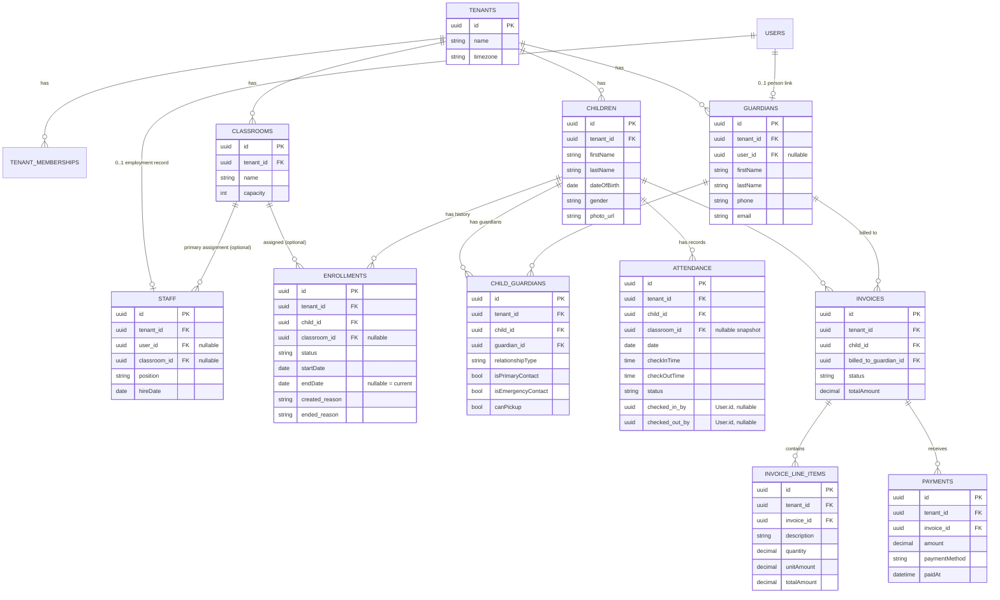

# Domain Model: Enrollment, Staffing, Attendance, Billing

- **Status:** Approved (design). Not yet implemented in `schema.prisma`.
- **Date:** 2026-07-19
- **Extends:** [ADR-0001: Core Platform Architecture](../adr/0001-core-platform-architecture.md)

This document is the approved reference for the domain model covering nursery
management, guardians, staffing, attendance, and billing. It builds entirely
on top of the already-implemented Identity module (`Tenant`, `User`, `Role`,
`TenantMembership`, `RefreshToken`, `PasswordResetToken`) without modifying
it. Implementing this as `schema.prisma` is a separate, later task.

It also reopens one of ADR-0001's stated non-goals (billing) in a
deliberately scoped way — see "Deferred Entities" for what remains excluded.

## Final ERD



## Entity reference

### Identity (existing, unchanged — described here only for context)

| Entity | Responsibility |
|---|---|
| `Tenant` | The nursery organization; the tenant-isolation boundary itself. Carries `timezone` so date-scoped records elsewhere (attendance, enrollment) have an unambiguous local day boundary. |
| `User` | Global login identity (email + password hash). Not tenant-scoped — represents a real person's capacity to authenticate, independent of any specific tenant relationship. |
| `Role` | System-defined (and future custom, per-tenant) role lookup — `OWNER`/`ADMIN`/`STAFF` today, `GUARDIAN` to be added when guardian portal login ships. |
| `TenantMembership` | A user's role and status within exactly one tenant. MVP enforces one active membership per user at the application layer (not a DB constraint), leaving room for multi-tenant membership later without a schema change. The sole source of "what can this login do, in which tenant." |
| `RefreshToken` / `PasswordResetToken` | Session and credential-recovery mechanics, scoped to the user's global identity. |

### New (this document)

| Entity | Responsibility |
|---|---|
| `Classroom` | A room/group children are assigned to within a tenant. Deliberately minimal (`name`, `capacity`) — no age-range fields, since nothing in current scope needs age-based room logic yet. |
| `Child` | Biographical record of an enrolled child (`firstName`, `lastName`, `dateOfBirth`, `gender`, `photo_url`). Holds no classroom or enrollment-status field — that data lives in `Enrollment` so placement history is never silently overwritten. |
| `Enrollment` | The historized record of a child's placement over time: which classroom, what status (`WAITLISTED`/`ACTIVE`/`WITHDRAWN`), when it started and ended, and why (`created_reason`, `ended_reason`). A child's *current* classroom/status is derived from the `Enrollment` row with `endDate IS NULL` — never stored redundantly on `Child`. |
| `Guardian` | A tenant-scoped contact profile for a real-world person responsible for a child (parent, grandparent, authorized contact). Optionally linked to a `User` (`user_id`, nullable) for portal login — many guardians (emergency-only contacts) never need one. |
| `ChildGuardian` | Join table expressing the many-to-many relationship between children and guardians. Carries relationship-specific facts (`relationshipType`, `isPrimaryContact`, `isEmergencyContact`, `canPickup`) on the *pairing*, not on `Guardian` — the same person could in principle relate differently to two different children. |
| `Staff` | Employment record within a tenant (`position`, `hireDate`, primary `classroom_id`). Optionally linked to a `User` for portal login, for the same reason as `Guardian` — not every staff member needs system access. |
| `Attendance` | Daily check-in/check-out record per child. Carries its own `classroom_id` snapshot, independent of `Enrollment`, since a child's attendance-day room can differ from their ongoing placement (e.g. temporary coverage). `checked_in_by`/`checked_out_by` are dedicated actor references, written once each and never overwritten by unrelated edits to the row — unlike the generic `created_by`/`updated_by` audit columns, which could otherwise be overwritten by an unrelated correction and lose their specific meaning. |
| `Invoice` | A billing document for one child, billed to one guardian. Carries a status lifecycle (`DRAFT`/`ISSUED`/`PARTIALLY_PAID`/`PAID`/`OVERDUE`/`VOID`) and a stored `totalAmount`. |
| `InvoiceLineItem` | Itemized charges within an invoice (tuition, late fee, meal plan, etc.). |
| `Payment` | A payment applied to an invoice. An invoice can have many payments — this is what makes **partial payment** possible without any special-casing: the invoice is "paid" once payments sum to the total, not because a single payment matched it exactly. |

## Relationships and cardinality

| Relationship | Cardinality | Notes |
|---|---|---|
| Tenant → TenantMembership | 1 — many | Existing (Identity) |
| Tenant → Classroom / Child / Guardian | 1 — many | Every tenant-owned table's top-level anchor |
| User → Staff | 1 — 0..1 | Optional; a `User` may have no employment record at all |
| User → Guardian | 1 — 0..1 | Optional; a `User` may have no guardian profile at all |
| Classroom → Enrollment | 1 — many | Nullable on `Enrollment` (pre-assignment/waitlist) |
| Classroom → Staff | 1 — many | Nullable; primary/display assignment only, not scheduling |
| Child → Enrollment | 1 — many | Full placement history; at most one *open* (`endDate IS NULL`) at a time — see Business Invariants |
| Child ↔ Guardian | many — many | Via `ChildGuardian` |
| Child → Attendance | 1 — many | At most one per calendar day — see Business Invariants |
| Child → Invoice | 1 — many | A child accumulates invoices over time |
| Guardian → Invoice | 1 — many | Who is billed; may differ from "primary" guardian in `ChildGuardian` |
| Invoice → InvoiceLineItem | 1 — many | |
| Invoice → Payment | 1 — many | The mechanism enabling partial payment |

## Tenant ownership rules

- Every new table in this document carries its **own** `tenant_id` column, denormalized directly on the row — including join/detail tables (`ChildGuardian`, `InvoiceLineItem`) that could technically derive tenant scope through `child_id`/`invoice_id`. This mirrors `tenant_memberships` and keeps every RLS policy a simple, fast, single-table check rather than a cross-table subquery.
- `User` is the one entity that is **not** tenant-owned — it's global, by design, matching the Identity module's membership model. `Staff`/`Guardian` reference `User` only as an *optional* login link; the `Staff`/`Guardian` row itself remains fully tenant-owned via its own `tenant_id`, independent of which (global) `User` it may point to.
- **Open invariant, not DB-enforced:** nothing prevents `Staff.user_id` / `Guardian.user_id` from being set to a user who has no actual `TenantMembership` in that tenant. This is a cross-table condition with no trigger planned — enforcing it is the responsibility of whichever service links the two (e.g. the future invite/portal-provisioning flow), consistent with how the Identity module already treats cross-table conditions as business rules rather than constraints.

## RLS implications

- Every new tenant-owned table needs `ENABLE ROW LEVEL SECURITY` + `FORCE ROW LEVEL SECURITY` + a fail-closed policy, exactly matching the pattern already implemented and verified for `tenant_memberships`:
  ```sql
  USING (
    current_setting('app.tenant_id', true) IS NOT NULL
    AND tenant_id = current_setting('app.tenant_id', true)::uuid
  )
  ```
  applied with a matching `WITH CHECK` clause.
- This means **every** new table from this document — `classrooms`, `children`, `enrollments`, `guardians`, `child_guardians`, `staff`, `attendance`, `invoices`, `invoice_line_items`, `payments` — needs its own policy migration when implemented; there are no exceptions among them (unlike `roles`/`users` in Identity, which are cross-tenant by design and intentionally have no tenant-isolation policy).
- The database connection must continue to be the least-privilege `nursery_app` role (not the `nursery` superuser/owner) for any of this to have real effect — already established and verified in the Identity work.
- Denormalizing `tenant_id` onto join tables (`ChildGuardian`, `InvoiceLineItem`) specifically avoids RLS policies that would otherwise need to join to a parent table to determine scope — slower and more fragile than a direct column check.

## Business invariants

**Enforceable at the database level (partial unique indexes, matching the pattern already used for `users`/`tenant_memberships`/`roles`):**

- One attendance record per child per day: `UNIQUE(child_id, date)` on `Attendance`.
- Unique child–guardian relationship: `UNIQUE(child_id, guardian_id)` on `ChildGuardian`, scoped to `deleted_at IS NULL` (so a removed relationship can be legitimately re-created later, same reuse pattern as elsewhere).
- One active enrollment per child: `UNIQUE(child_id) WHERE endDate IS NULL AND deleted_at IS NULL` on `Enrollment` — at most one *open-ended* placement per child at any time.

**Application-layer rules (not DB-enforced, by deliberate choice consistent with the Identity module's constraints-vs-business-rules split):**

- `Staff.user_id` / `Guardian.user_id`, if set, must correspond to a user with an active `TenantMembership` in that same tenant.
- Enrollment transitions must not overlap: creating a new `Enrollment` row for a child requires closing (`endDate`) the previous open one first. A DB-level exclusion constraint could enforce this later if it proves error-prone in practice; not built now.
- `Invoice.totalAmount` should reconcile with `SUM(InvoiceLineItem.totalAmount)`, and `Invoice.status` should track `SUM(Payment.amount)` against `totalAmount` — both are maintained by application logic, not a trigger or generated column. Already flagged as a drift risk worth monitoring, not solved here.
- One active `TenantMembership` per user (existing Identity rule, restated here because `Staff`/`Guardian` depend on it existing).
- Soft-delete discipline: every table above filters `WHERE deleted_at IS NULL` by default in application queries — Postgres does not do this automatically.

## Soft-delete cascade policy

Soft-deleting a `Child`, `Guardian`, `Classroom`, or `Invoice` (setting `deleted_at`) **never cascades physically** to related rows. Nothing referencing a soft-deleted row is deleted, altered, or hidden as a side effect:

- Soft-deleting a `Classroom` does not touch existing `Enrollment` or `Attendance` rows that reference it — a child's placement history and attendance snapshots remain exactly as recorded, even after the classroom itself is closed/removed.
- Soft-deleting a `Guardian` does not touch existing `ChildGuardian` or `Invoice` rows — historical billing and guardianship records stay intact and legible after a guardian profile is removed.
- Soft-deleting a `Child` does not touch existing `Enrollment`, `Attendance`, `ChildGuardian`, or `Invoice` rows referencing that child — the full historical record survives.
- Soft-deleting an `Invoice` does not touch its existing `InvoiceLineItem` or `Payment` rows — a voided/removed invoice's line items and payment history remain queryable.

This isn't a policy that needs separate enforcement — it's a direct consequence of what a soft delete *is* in this schema: an application-level `UPDATE` setting `deleted_at`, never a SQL `DELETE`. There is no DB-level `ON DELETE` cascade to trigger in the first place, and none of these tables use `onDelete: Cascade`. Hard deletes remain out of scope for every domain table, consistent with the "no hard-delete of users" principle already established for Identity.

## Deferred entities and rationale

Every deferral below was decided using the same test: *is skipping this now a cheap, additive change later, or does it lose data/history that can't be reconstructed?* Cheap-later → deferred. Expensive-or-irreversible-later → built now (which is why `Enrollment` and daily `Attendance`'s underlying model were kept despite looking like "more" for MVP).

| Deferred item | Rationale |
|---|---|
| `BillingAccount` / `BillingAccountGuardian` (split billing, third-party payers) | Real need, but adding it later is a clean, low-risk migration: one `BillingAccount` per existing guardian, backfilled unambiguously. Not worth the upfront complexity before it's validated. |
| `ClassroomStaff` join table | Would be superseded the moment a proper `Shift`/scheduling module exists, which models staff-classroom-time far better than a static join ever could. Building it now risks building something immediately redundant. |
| Session-based attendance (multiple check-in/out per day) | Relaxing `UNIQUE(child_id, date)` later is a pure additive change — every historical daily row remains valid as "session 1 of 1." No reason to build the more complex version before it's needed. |
| `Tenant.locale` | Pure display/i18n concern with no data-interpretation risk if added later (unlike `timezone`, which is needed now to avoid ambiguous historical date data). |
| `DailyReport`, `Incident`, `MedicalRecord`, `MedicationAdministration` | Future modules, not yet scoped. `MedicalRecord` in particular is flagged as needing fine-grained permissions (not just roles) once built — validates the `AuthorizationService` abstraction built into Identity specifically to allow that swap later without touching call sites. |
| `Conversation` / `ConversationParticipant` / `Message` | Future messaging module. Explicitly *not* a naive 1:1 chat table — a real thread about one child typically involves multiple guardians and staff. |
| `Shift` | Future scheduling module; also the eventual replacement for `ClassroomStaff`, see above. |
| `AuditLog` | Deferred since Identity's initial design, but recommended to be pulled forward to whichever ships first among incidents/medical records — `created_by`/`updated_by` alone can't answer "who viewed this record and when." |
| `Permission` / `RolePermission` | Phase 2 of Identity's RBAC, already anticipated by the `roles` table's lookup-table shape (chosen over a native enum specifically to make this additive later). |

---

Next step (separate task, pending approval): implement this model in `schema.prisma`, generate the migration, add RLS policies for every new tenant-owned table, and seed the `GUARDIAN` role.
