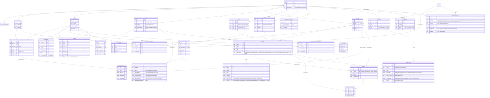

# Domain Model: Enrollment, Staffing, Attendance, Billing

- **Status:** Mixed — see below. Originally approved 2026-07-19 and since implemented; extended 2026-07-27 with the Configuration Engine, approved design only.
- **Date:** 2026-07-19 (original) · 2026-07-27 (Configuration Engine extension)
- **Extends:** [ADR-0001: Core Platform Architecture](../adr/0001-core-platform-architecture.md)
- **Related (Configuration Engine extension):** [ADR-0012](./adrs/0012-enrollment-historized-not-mutable-status.md), [ADR-0017](./adrs/0017-configuration-before-operations.md)

This document is the approved reference for the domain model covering nursery
management, guardians, staffing, attendance, and billing. It builds entirely
on top of the already-implemented Identity module (`Tenant`, `User`, `Role`,
`TenantMembership`, `RefreshToken`, `PasswordResetToken`) without modifying
it.

**Build status of the two halves of this document, stated plainly so neither is mistaken for the other:**
- **Original model** (`Classroom`, `Child`, `Enrollment`, `Guardian`, `ChildGuardian`, `Staff`, `StaffPayroll`, `Attendance`, `Invoice`, `InvoiceLineItem`, `Payment`) — **implemented and shipped.** The "not yet implemented" status this document originally carried is stale for this half; these tables exist in `schema.prisma` today.
- **Configuration Engine extension** (`Plan`, `PlanPrice`, `Fee`, `PlanFee`, `ChildFeeAssignment`, `Discount`, `ChildDiscountAssignment`, `SiblingDiscountTier`, `Waiver`, `Holiday`, `BillingRun`, `PaymentAllocation`, `ManualOverride`, plus modifications to `Enrollment`, `InvoiceLineItem`, `Payment`, `Tenant`) — **approved design only, not implemented.** This formalizes the business rules from the Configuration Engine workflow review (Sprint 12) into an actual domain model, per [ADR-0017](./adrs/0017-configuration-before-operations.md). Implementing this as a `schema.prisma` migration is a separate, later task, exactly as the original model was once separate from this document.

It also reopens one of ADR-0001's stated non-goals (billing) in a
deliberately scoped way — see "Deferred Entities" for what remains excluded.

## Final ERD


```mermaid
erDiagram
    TENANTS ||--o{ TENANT_MEMBERSHIPS : "has"
    TENANTS ||--o{ CLASSROOMS : "has"
    TENANTS ||--o{ CHILDREN : "has"
    TENANTS ||--o{ GUARDIANS : "has"

    USERS ||--o| STAFF : "0..1 employment record"
    USERS ||--o| GUARDIANS : "0..1 person link"
    STAFF ||--o{ STAFF_PAYROLL : "compensation record (optional, OWNER/ADMIN only)"

    CLASSROOMS ||--o{ ENROLLMENTS : "assigned (optional)"
    CLASSROOMS ||--o{ STAFF : "primary assignment (optional)"

    CHILDREN ||--o{ ENROLLMENTS : "has history"
    CHILDREN ||--o{ CHILD_GUARDIANS : "has guardians"
    GUARDIANS ||--o{ CHILD_GUARDIANS : "guardian of"
    CHILDREN ||--o{ ATTENDANCE : "has records"
    CHILDREN ||--o{ INVOICES : "billed for"
    GUARDIANS ||--o{ INVOICES : "billed to"

    INVOICES ||--o{ INVOICE_LINE_ITEMS : "contains"
    INVOICES ||--o{ PAYMENTS : "receives (via allocation)"

    %% ===== Configuration Engine extension (approved design, not implemented) =====
    TENANTS ||--o{ PLANS : "configures"
    TENANTS ||--o{ FEES : "configures"
    TENANTS ||--o{ DISCOUNTS : "configures"
    TENANTS ||--o{ SIBLING_DISCOUNT_TIERS : "configures"
    TENANTS ||--o{ HOLIDAYS : "configures"

    PLANS ||--o{ PLAN_PRICES : "has price history"
    PLANS ||--o{ ENROLLMENT_BILLING_TERMS : "assigned via (plan_id)"
    PLANS ||--o{ PLAN_FEES : "bundles"
    ENROLLMENTS ||--o| ENROLLMENT_BILLING_TERMS : "1:1, created/closed together"
    GUARDIANS ||--o{ ENROLLMENT_BILLING_TERMS : "financially responsible for"
    FEES ||--o{ PLAN_FEES : "attached to plans via"
    FEES ||--o{ CHILD_FEE_ASSIGNMENTS : "opted into by children"
    CHILDREN ||--o{ CHILD_FEE_ASSIGNMENTS : "has optional fees"

    DISCOUNTS ||--o{ CHILD_DISCOUNT_ASSIGNMENTS : "applied to children"
    CHILDREN ||--o{ CHILD_DISCOUNT_ASSIGNMENTS : "has discounts"

    CHILDREN ||--o{ WAIVERS : "has"

    GUARDIANS ||--o{ PAYMENTS : "pays as billing party"
    PAYMENTS ||--o{ PAYMENT_ALLOCATIONS : "allocated across"
    INVOICES ||--o{ PAYMENT_ALLOCATIONS : "receives allocation"

    TENANTS ||--o{ BILLING_RUNS : "generates invoices via"

    TENANTS ||--o{ MANUAL_OVERRIDES : "audits exceptions via"
    USERS ||--o{ MANUAL_OVERRIDES : "applied by (OWNER/ADMIN only)"

    INVOICES ||--o{ CREDIT_NOTES : "money owed back, references"
    GUARDIANS ||--o{ CREDIT_NOTES : "owed to"

    TENANTS {
        uuid id PK
        string name
        string timezone
        int billingAnchorDay "1-28, Configuration Engine, design only"
        int billingLeadTimeDays "Configuration Engine, design only"
    }
    ENROLLMENTS {
        uuid id PK
        uuid tenant_id FK
        uuid child_id FK
        uuid classroom_id FK "nullable"
        string status "WAITLISTED/ACTIVE/SUSPENDED/WITHDRAWN"
        date startDate
        date endDate "nullable = current"
        string created_reason
        string ended_reason
    }
    ENROLLMENT_BILLING_TERMS {
        uuid id PK
        uuid tenant_id FK
        uuid enrollment_id FK "unique - 1:1 with Enrollment, created/closed in lockstep, never independently"
        uuid plan_id FK "nullable, Configuration Engine, design only"
        uuid billing_guardian_id FK "who is financially responsible for this placement"
        decimal customRateAmount "nullable"
        string customRateReason "nullable, required if customRateAmount set"
        decimal depositAmount "nullable"
        string depositRefundPolicy "nullable: FORFEIT/APPLY_TO_FINAL/NON_REFUNDABLE"
        date withdrawalNoticeGivenDate "nullable"
    }
    CHILDREN {
        uuid id PK
        uuid tenant_id FK
        string firstName
        string lastName
        date dateOfBirth
        string gender
        string photo_url
    }
    GUARDIANS {
        uuid id PK
        uuid tenant_id FK
        uuid user_id FK "nullable"
        string firstName
        string lastName
        string phone
        string email
    }
    CHILD_GUARDIANS {
        uuid id PK
        uuid tenant_id FK
        uuid child_id FK
        uuid guardian_id FK
        string relationshipType
        bool isPrimaryContact
        bool isEmergencyContact
        bool canPickup
    }
    STAFF {
        uuid id PK
        uuid tenant_id FK
        uuid user_id FK "nullable"
        uuid classroom_id FK "nullable"
        string firstName
        string lastName
        string position
        date hireDate
    }
    STAFF_PAYROLL {
        uuid id PK
        uuid tenant_id FK
        uuid staff_id FK
        string payType
        decimal payRate
        string payFrequency
        string currency
        date effectiveDate
    }
    CLASSROOMS {
        uuid id PK
        uuid tenant_id FK
        string name
        int capacity
    }
    ATTENDANCE {
        uuid id PK
        uuid tenant_id FK
        uuid child_id FK
        uuid classroom_id FK "nullable snapshot"
        date date
        time checkInTime
        time checkOutTime
        string status
        uuid checked_in_by "User.id, nullable"
        uuid checked_out_by "User.id, nullable"
    }
    INVOICES {
        uuid id PK
        uuid tenant_id FK
        uuid child_id FK
        uuid billed_to_guardian_id FK
        string status
        decimal totalAmount
        string invoiceNumber "Configuration Engine review addition, design only - sequential, tenant-scoped, human-readable (e.g. INV-2026-000123); migration against already-shipped data, see note below"
    }
    INVOICE_LINE_ITEMS {
        uuid id PK
        uuid tenant_id FK
        uuid invoice_id FK
        string description
        decimal quantity
        decimal unitAmount
        decimal totalAmount
        string sourceType "nullable, Configuration Engine, design only: PLAN_TUITION/FEE/DISCOUNT/WAIVER/ONE_TIME_CHARGE"
        string chargeCategory "nullable, Configuration Engine, design only: LATE_PICKUP/FIELD_TRIP/DAMAGED_PROPERTY/OTHER"
        uuid plan_price_id FK "nullable, Configuration Engine, design only - exact PlanPrice version that generated this line, set when sourceType=PLAN_TUITION"
    }
    PAYMENTS {
        uuid id PK
        uuid tenant_id FK
        uuid invoice_id FK "nullable as of Configuration Engine - see below, design only"
        uuid guardian_id FK "Configuration Engine, design only - the billing party"
        decimal amount
        string paymentMethod
        datetime paidAt
    }

    %% ===== Configuration Engine entities (approved design, not implemented) =====
    PLANS {
        uuid id PK
        uuid tenant_id FK
        string name "e.g. Full Time, Half Time, Part Time, Daily"
        string billingCycle "MONTHLY/WEEKLY/DAILY"
        string scheduleDaysOfWeek "permitted attendance days"
        time scheduleStartTime "nullable = any time within working hours"
        time scheduleEndTime "nullable"
        bool isActive
    }
    PLAN_PRICES {
        uuid id PK
        uuid tenant_id FK
        uuid plan_id FK
        decimal amount
        date effectiveFrom
        date effectiveTo "nullable = current"
    }
    FEES {
        uuid id PK
        uuid tenant_id FK
        string name "e.g. Meals, Transportation, Registration"
        decimal amount
        string type "RECURRING/ONE_TIME"
        bool isActive
    }
    PLAN_FEES {
        uuid id PK
        uuid tenant_id FK
        uuid plan_id FK
        uuid fee_id FK
        bool isMandatory
    }
    CHILD_FEE_ASSIGNMENTS {
        uuid id PK
        uuid tenant_id FK
        uuid child_id FK
        uuid fee_id FK
        decimal snapshotAmount "captured at assignment time - Fee.amount changing later never reprices this assignment"
        date effectiveFrom
        date effectiveTo "nullable = current"
    }
    DISCOUNTS {
        uuid id PK
        uuid tenant_id FK
        string name
        string type "PERCENTAGE/FIXED_AMOUNT"
        decimal amount
        bool stackable
        string scope "BASE_TUITION_ONLY/ALL_CHARGES"
        bool isActive
    }
    CHILD_DISCOUNT_ASSIGNMENTS {
        uuid id PK
        uuid tenant_id FK
        uuid child_id FK
        uuid discount_id FK
        decimal snapshotAmount "captured at assignment time - Discount.amount changing later never reprices this assignment"
        date effectiveFrom
        date effectiveTo "nullable = current"
    }
    SIBLING_DISCOUNT_TIERS {
        uuid id PK
        uuid tenant_id FK
        int siblingCountThreshold "e.g. 2, 3"
        decimal discountPercentage
        date effectiveFrom
        date effectiveTo "nullable = current"
    }
    WAIVERS {
        uuid id PK
        uuid tenant_id FK
        uuid child_id FK
        string type "FULL/PARTIAL"
        decimal percentage
        string reasonCode "OWNER_FAMILY/SCHOLARSHIP/HARDSHIP/STAFF_BENEFIT/OTHER"
        string reasonNote "nullable"
        date effectiveFrom
        date effectiveTo "nullable, requires reviewAnnually if null"
        bool reviewAnnually
        uuid approved_by FK "User.id, OWNER/ADMIN only"
    }
    HOLIDAYS {
        uuid id PK
        uuid tenant_id FK
        date date
        string name
        string type "FULL_CLOSURE/PARTIAL_CLOSURE"
        time earlyCloseTime "nullable, used when PARTIAL_CLOSURE"
    }
    BILLING_RUNS {
        uuid id PK
        uuid tenant_id FK
        date periodStart
        date periodEnd
        string status "COMPLETED/PARTIAL_FAILURE"
        datetime runAt
    }
    PAYMENT_ALLOCATIONS {
        uuid id PK
        uuid tenant_id FK
        uuid payment_id FK
        uuid invoice_id FK
        decimal amountApplied
    }
    MANUAL_OVERRIDES {
        uuid id PK
        uuid tenant_id FK
        string overrideType "WAIVER/ONE_TIME_CHARGE/DISCOUNT_OVERRIDE/ATTENDANCE_EXCEPTION_CHARGE/PLAN_CHANGE_IMMEDIATE/WITHDRAWAL_NOTICE_WAIVED/OTHER"
        string reasonCode "HARDSHIP/SCHOLARSHIP/STAFF_BENEFIT/GOODWILL/CORRECTION/OTHER"
        string reasonNote "nullable, required if reasonCode=OTHER"
        string relatedEntityType
        uuid relatedEntityId
        string previousValue "nullable - no 'previous' state for pure additions like a new one-time charge"
        string newValue
        uuid applied_by FK "User.id, OWNER/ADMIN only"
        datetime appliedAt
    }
    CREDIT_NOTES {
        uuid id PK
        uuid tenant_id FK
        uuid invoice_id FK "the original invoice this credit references"
        uuid guardian_id FK "who the money is owed back to"
        decimal amount
        string reasonCode "WITHDRAWAL_PRORATION/RETROACTIVE_WAIVER/OVERCHARGE_CORRECTION/OTHER"
        string status "OPEN/APPLIED/REFUNDED"
        uuid applied_to_invoice_id FK "nullable, if status=APPLIED"
        string refundedVia "nullable, if status=REFUNDED - reuses the exact same PaymentMethod enum as Payment.paymentMethod, never a separately-maintained list"
        string creditNoteNumber "sequential, tenant-scoped, human-readable, same convention as Invoice.invoiceNumber"
        uuid created_by FK "User.id, OWNER/ADMIN only"
        datetime createdAt
    }
```

## Entity reference

### Identity (existing, unchanged — described here only for context)

| Entity | Responsibility |
|---|---|
| `Tenant` | The nursery organization; the tenant-isolation boundary itself. Carries `timezone` so date-scoped records elsewhere (attendance, enrollment) have an unambiguous local day boundary. |
| `User` | Global login identity (email + password hash). Not tenant-scoped — represents a real person's capacity to authenticate, independent of any specific tenant relationship. |
| `Role` | System-defined (and future custom, per-tenant) role lookup — `OWNER`/`ADMIN`/`STAFF` today, `GUARDIAN` to be added when guardian portal login ships. |
| `TenantMembership` | A user's role and status within exactly one tenant. MVP enforces one active membership per user at the application layer (not a DB constraint), leaving room for multi-tenant membership later without a schema change. The sole source of "what can this login do, in which tenant." |
| `RefreshToken` / `PasswordResetToken` | Session and credential-recovery mechanics, scoped to the user's global identity. |

### Original (this document, since implemented and shipped)

| Entity | Responsibility |
|---|---|
| `Classroom` | A room/group children are assigned to within a tenant. Deliberately minimal (`name`, `capacity`) — no age-range fields, since nothing in current scope needs age-based room logic yet. *(Reviewed again during the Configuration Engine workflow pass — age-band eligibility was identified as a real gap, but deliberately left out of this extension; see "Considered, not included" below.)* |
| `Child` | Biographical record of an enrolled child (`firstName`, `lastName`, `dateOfBirth`, `gender`, `photo_url`). Holds no classroom or enrollment-status field — that data lives in `Enrollment` so placement history is never silently overwritten. |
| `Enrollment` | The historized record of a child's placement over time — extended by the Configuration Engine, see below. |
| `Guardian` | A tenant-scoped contact profile for a real-world person responsible for a child (parent, grandparent, authorized contact). Optionally linked to a `User` (`user_id`, nullable) for portal login — many guardians (emergency-only contacts) never need one. As of the Configuration Engine extension, `Guardian` also acts as the **de facto billing account** — `Payment`, `PaymentAllocation`, `CreditNote`, and sibling-discount computation are all anchored to `Guardian`, not `Child`. This is a deliberate V1 simplification, not the deferred `BillingAccount`/`BillingAccountGuardian` entity (still listed in "Deferred entities" below) — it breaks specifically for two guardians of one household billed separately (e.g. shared custody), where children would not be recognized as siblings for discount purposes since each guardian is treated as an independent billing party. The deferred-entities rationale for `BillingAccount` has been updated to name this as exactly what it will need to absorb when built. |
| `ChildGuardian` | Join table expressing the many-to-many relationship between children and guardians. Carries relationship-specific facts (`relationshipType`, `isPrimaryContact`, `isEmergencyContact`, `canPickup`) on the *pairing*, not on `Guardian` — the same person could in principle relate differently to two different children. |
| `Staff` | Employment record within a tenant. Owns `firstName`/`lastName` directly, as required fields — identity does not depend on an optional `User` link or `TenantMembership` lookup (see [ADR-0001 (product)](./adrs/0001-staff-owns-employee-profile.md)), matching how `Guardian` and `Child` already carry their own names. Also holds `position`, `hireDate`, and primary `classroom_id`. Optionally linked to a `User` for portal login, for the same reason as `Guardian` — not every staff member needs system access. |
| `StaffPayroll` | A staff member's compensation record (`payType`, `payRate`, `payFrequency`, `currency`, `effectiveDate`), linked to `Staff` only by `staffId`. Deliberately mutable/overwritten-in-place, not historized like `Enrollment`. Fully separate module — own routes, contracts, and UI — gated `OWNER`/`ADMIN`-only for both read and write, since compensation is a stricter sensitivity class than the rest of `Staff`, which any authenticated tenant member can read (see [ADR-0002](./adrs/0002-payroll-independent-from-staff.md)). |
| `Attendance` | Daily check-in/check-out record per child. Carries its own `classroom_id` snapshot, independent of `Enrollment`, since a child's attendance-day room can differ from their ongoing placement (e.g. temporary coverage). `checked_in_by`/`checked_out_by` are dedicated actor references, written once each and never overwritten by unrelated edits to the row — unlike the generic `created_by`/`updated_by` audit columns, which could otherwise be overwritten by an unrelated correction and lose their specific meaning. Attendance recording is **never** technically blocked by any Configuration Engine rule — see [ADR-0017](./adrs/0017-configuration-before-operations.md) and the Attendance-validation note under `Plan` below. |
| `Invoice` | A billing document for one child, billed to one guardian. Carries a status lifecycle (`DRAFT`/`ISSUED`/`PARTIALLY_PAID`/`PAID`/`OVERDUE`/`VOID`) and a stored `totalAmount`. |
| `InvoiceLineItem` | Itemized charges within an invoice — extended by the Configuration Engine, see below. |
| `Payment` | A payment — extended by the Configuration Engine, see below. |

### Configuration Engine extension (approved design, not implemented)

Formalizes the business rules from the Sprint 12 Configuration Engine workflow design and its adversarial review into actual entities. See [ADR-0017](./adrs/0017-configuration-before-operations.md) for the reasoning; this table states what each entity *is*.

| Entity | Responsibility |
|---|---|
| `Plan` | The commercial + schedule offering a child is enrolled under (Full Time, Half Time, Part Time, Daily). Carries `billingCycle`, the permitted attendance schedule (`scheduleDaysOfWeek`, `scheduleStartTime`/`scheduleEndTime`), and `isActive`. Deliberately does **not** carry price directly — see `PlanPrice`. Deliberately does **not** reference a specific `Classroom` — a Plan's eligible classroom(s) is a real question (age-band matching) explicitly deferred, see "Considered, not included" below. **Attendance validation:** an out-of-schedule check-in against a `Plan` is never blocked — it is recorded normally and flagged as a billable-exception candidate for `ManualOverride` (`overrideType = ATTENDANCE_EXCEPTION_CHARGE`) review. Child safety and physical-presence recording always outrank a billing rule. |
| `PlanPrice` | A `Plan`'s price, historized exactly like `Enrollment` — one row per price period (`amount`, `effectiveFrom`, `effectiveTo` nullable = current). A price change never retroactively reprices an already-enrolled child; `EnrollmentBillingTerms.customRateAmount`, if set, overrides the plan's price for that specific child regardless of `PlanPrice`. A `PlanPrice` change also never retroactively corrects an already-`ISSUED` invoice, even if backdated to overlap that invoice's period — `ISSUED` invoices are immutable regardless of any later price change; a correction goes through `ManualOverride`/`CreditNote` instead, the same as every other post-issuance correction in this document. |
| `Fee` | A recurring or one-time charge component beyond base tuition (meals, transportation, registration). Typed `RECURRING`/`ONE_TIME`. Mandatory-vs-optional is a property of the `Plan`↔`Fee` pairing, not of `Fee` itself — see `PlanFee`. |
| `PlanFee` | Join table: which `Fee`s are bundled with a `Plan`, and whether each is `isMandatory` for that plan or an optional add-on. The same `Fee` (e.g. "Meals") can be mandatory on one `Plan` and optional on another. |
| `ChildFeeAssignment` | Historized (like `Enrollment`) record of which optional `Fee`s a specific child has opted into, beyond what's mandatory for their `Plan`. |
| `Discount` | A configured, reusable reduction rule — `PERCENTAGE` or `FIXED_AMOUNT`, tagged `stackable` (combines with other discounts) or not (exclusive — best-for-the-family wins if multiple exclusive discounts would apply), scoped to `BASE_TUITION_ONLY` by default. Creating/editing a `Discount` rule is `OWNER`/`ADMIN`-only, the same sensitivity tier as `Waiver`. |
| `ChildDiscountAssignment` | A specific `Discount` applied to a specific child (a negotiated deal, a time-limited promotion) — historized, supporting an expiring promotional discount via `effectiveTo`. Distinct from `SiblingDiscountTier`, which is never assigned per-child. |
| `SiblingDiscountTier` | A tenant-configured table (`siblingCountThreshold` → `discountPercentage`), e.g. 2nd child → 10%, 3rd+ → 20%. Never assigned per-child and never stored on a specific enrollment — computed dynamically at invoice-generation time from the count of `ACTIVE`/`SUSPENDED` `Enrollment`s whose period overlaps the billing period being invoiced (never whichever Enrollments simply happen to be open at generation time — see the billing-period resolution invariant below) and whose `EnrollmentBillingTerms.billing_guardian_id` matches, applied to the lowest-priced eligible child(ren). A sibling's withdrawal automatically produces the correct recalculated discount for the rest, with no manual fix-up. Always an additional stackable reduction — it never competes with or is excluded by an exclusive `Discount`; it simply adds to whatever `Discount`(s) already apply, and like every `Discount`, is applied before `Waiver`. |
| `Waiver` | A full or partial reduction for one child (owner's own children, scholarship, hardship, staff benefit). Always requires an `effectiveFrom` and either an `effectiveTo` or an explicit `reviewAnnually` flag — an indefinite, unreviewed waiver is not a supported state. Applies **last**, after all `Discount`s, against the post-discount subtotal. `OWNER`/`ADMIN`-only to create. A waived child's invoice is **always generated at full value** with the waiver as a visible line-level reduction — invoice generation is never suppressed for a waived child. |
| `Holiday` | An explicit, date-specific tenant closure entry (`FULL_CLOSURE` or `PARTIAL_CLOSURE` with an `earlyCloseTime`) — deliberately **not** an auto-recurring rule, since Islamic calendar holidays shift relative to the Gregorian calendar year over year, and a fixed-date recurrence would silently drift wrong within this product's own core Egypt/GCC market. Affects attendance/check-in validation only — never triggers a billing adjustment; tuition pays for a reserved capacity slot, not a metered attended day. |
| `BillingRun` | One row per tenant per billing period, recording that invoice generation happened (`periodStart`, `periodEnd`, `status`, `runAt`). This is the idempotency anchor: re-running generation for a period with an existing `BillingRun` updates the still-`DRAFT` invoices from that run in place rather than creating duplicates. Once an invoice is `ISSUED`, it is never touched by regeneration — a correction at that point goes through `ManualOverride`/a credit note instead. |
| `PaymentAllocation` | Join table between `Payment` and `Invoice`, `amountApplied` per pairing — this is what lets one lump-sum `Payment` spread across several outstanding `Invoice`s (oldest-first, across *all* of a guardian's children, not per-child) and what lets a `Payment`'s unallocated remainder function as guardian-level credit without a separately-stored balance field (the credit is simply `Payment.amount` minus the sum of its `PaymentAllocation`s — computed, not stored redundantly, matching how `Invoice.status` is already computed from `Payment` sums rather than stored independently). |
| `ManualOverride` | The single, unified audit trail for every exception path in the Configuration Engine — a waiver, an ad hoc one-time charge, a discount override, an out-of-schedule attendance charge, an immediate (not next-cycle) plan change, a withdrawal-notice waiver. One mechanism, not a bespoke one per exception type: `OWNER`/`ADMIN`-only, a mandatory `reasonCode` from a controlled list (free text only permitted when `reasonCode = OTHER`), and a full audit trail — `appliedBy`, `appliedAt`, `previousValue`, and `newValue` (the last two nullable together only for pure additions like a new one-time charge, which has no "previous" state to record). Deliberately **no** maker-checker/dual-authorization threshold — see [ADR-0017](./adrs/0017-configuration-before-operations.md) for why that large-ERP pattern is explicitly rejected here. |
| `CreditNote` | Money owed back to a guardian — from a prorated withdrawal, a retroactively-applied waiver, or an overcharge correction. References the original `Invoice`; never edits or deletes it, per [ADR-0013](./adrs/0013-soft-delete-universal-default.md)'s universal soft-delete/never-silently-overwritten default. `status` tracks whether it's still `OPEN`, has been `APPLIED` against a later invoice, or was `REFUNDED` as an actual cash/bank-transfer payout — a refund is money going *out* and is never modeled as a negative `Payment`, which would corrupt payment-history reporting. `OWNER`/`ADMIN`-only to create, the same authorization tier as every other `ManualOverride`-adjacent action. Carries its own `creditNoteNumber`, same sequential-numbering convention as `Invoice.invoiceNumber`. |
| `EnrollmentBillingTerms` | The financial terms of one `Enrollment`, split into its own 1:1 table rather than living directly on `Enrollment` — added during a maintainability review specifically to separate the Placement/Operations bounded context (`Enrollment` itself: child, classroom, status, dates) from the Billing/Finance one (which `Plan`, which `Guardian` pays, custom rate, deposit, withdrawal notice). The two are created and closed in lockstep — a `Plan` change or a withdrawal closes both rows together, exactly as it closed just `Enrollment` before this split — but a future billing-only feature now touches only this table, and a future operations-only feature touches only `Enrollment`, instead of both kinds of change competing for the same migration and the same review. |

**Guardian-reference hierarchy, stated explicitly:** four entities each carry their own guardian reference (`EnrollmentBillingTerms.billing_guardian_id`, `Invoice.billed_to_guardian_id`, `Payment.guardian_id`, `CreditNote.guardian_id`) — this is not four independent sources of truth. `EnrollmentBillingTerms.billing_guardian_id` is canonical, set once per placement. `Invoice.billed_to_guardian_id` defaults from it at generation time; `Payment`/`CreditNote` carry their own copy for the same reason `InvoiceLineItem.totalAmount` is its own stored snapshot rather than a live computation — each is a point-in-time record of who was responsible *when that record was created*, deliberately allowed to diverge from the current value (a one-off invoice billed to a different guardian for a specific reason) without that divergence being an error.

**How `ManualOverride` and `CreditNote` relate:** they are not competing records of the same thing. `ManualOverride` is the audit trail of a *decision* (who approved a retroactive waiver, and why). `CreditNote` is the *financial instrument* that decision produces when it affects an already-issued invoice. A retroactive waiver on a `DRAFT` invoice needs only a `ManualOverride` (the invoice hasn't been issued yet, so it can still be corrected directly); the same waiver applied after `ISSUED` needs both — the `ManualOverride` explaining why, the `CreditNote` representing the money now owed back.

**How a deposit moves through the model:** `EnrollmentBillingTerms.depositAmount`/`depositRefundPolicy` describe the *policy*; the money itself moves through the same mechanisms already defined for everything else, not a bespoke deposit pipeline. Collection is an ordinary `ONE_TIME_CHARGE` `InvoiceLineItem` (`chargeCategory = OTHER`, described in `description` — no dedicated category, since nothing queries on one yet). `FORFEIT` needs no further record — the charge was already paid and is simply never returned. `APPLY_TO_FINAL` needs no `CreditNote` either — the deposit payment's unallocated remainder is already guardian-level credit by construction (see `PaymentAllocation`), and it allocates against the final invoice through the same oldest-invoice-first mechanism as any other credit. Only an actual cash/bank-transfer refund needs a `CreditNote`, using `reasonCode = OTHER` with a `reasonNote`, the same as any other reason not worth a dedicated code yet — add one later, additively, if deposit-specific reporting ever becomes a real need.

**Why `InvoiceLineItem.sourceType` and `ManualOverride.overrideType` share vocabulary** (`WAIVER`, `ONE_TIME_CHARGE` appear in both): this is intentional correspondence, not duplication. A `WAIVER`-type `ManualOverride` is the decision; a `WAIVER`-sourced `InvoiceLineItem` is that decision's line-item consequence on an invoice. The two enums describe the same real-world event from two different vantage points (why it happened vs. what it produced), not two different concepts that happen to share a name.

**Why `ManualOverride` uses a polymorphic reference** (`relatedEntityType` + `relatedEntityId`) instead of a typed foreign key: it must reference many different kinds of records (an `Invoice`, an `Enrollment`, a `Waiver`) through one table, and a typed-FK-per-entity-type approach would mean a dozen nullable FK columns or a subtype hierarchy, both worse than one documented, consistently-shaped reference. The accepted trade-off: this relationship is **not** DB-enforceable (no real foreign-key constraint is possible on a polymorphic pair) — application-layer responsibility only, the same category of accepted trade-off already documented elsewhere in this file for `Staff.user_id`/`Guardian.user_id`.

**Known, accepted asymmetry — `CreditNote` vs. `PaymentAllocation`:** a `Payment` can split across multiple invoices via `PaymentAllocation`; a `CreditNote` can only apply to one invoice (`applied_to_invoice_id`, a single FK) — there is no `CreditNoteAllocation` equivalent. A guardian needing one credit split across two invoices isn't cleanly representable in V1. Not fixed now, because it hasn't come up as a real requirement yet and the fix is a clean, additive migration when it does — add a `CreditNoteAllocation` join table mirroring `PaymentAllocation`'s already-proven shape, not a redesign of `CreditNote` itself.

#### Modified entities

- **`Enrollment`** stays close to its original shape (`child_id`, `classroom_id`, `status`, `startDate`/`endDate`, `created_reason`/`ended_reason`) — its only Configuration Engine addition is **status** gaining `SUSPENDED` (now `WAITLISTED`/`ACTIVE`/`SUSPENDED`/`WITHDRAWN`). A suspended child's seat **counts toward classroom capacity** for V1 — evaluated through a single centralized capacity-counting rule (`status IN (ACTIVE, SUSPENDED)`), never duplicated inline across separate query sites, specifically so a future tenant-level policy (seat-held vs. seat-released on suspension) changes one rule's evaluation, not every place capacity is computed. That policy toggle is explicitly **not** built now — see "Considered, not included" below. A `SUSPENDED` child is excluded from the default/expected daily attendance roster (not expected to attend), but attendance recording is never technically blocked — an exceptional check-in is still recordable via the same out-of-schedule exception path `Plan` uses.
  A new `Enrollment` row for re-enrollment after withdrawal was already this ADR's behavior before the Configuration Engine — unchanged.
  Everything else originally proposed directly on `Enrollment` — `plan_id`, `billing_guardian_id`, `customRateAmount`/`customRateReason`, `depositAmount`/`depositRefundPolicy`, `withdrawalNoticeGivenDate` — moved to the new **`EnrollmentBillingTerms`** (1:1, see Entity Reference above) during a maintainability review, specifically to keep `Enrollment` itself focused on placement and stop it from accumulating fields across five different concerns. The historization reasoning is unchanged: a Plan assignment still reuses `Enrollment`'s existing historized-period pattern exactly, per [ADR-0012](./adrs/0012-enrollment-historized-not-mutable-status.md)'s own "Future implications" — a Plan change (or any billing-terms change) closes the current `Enrollment`+`EnrollmentBillingTerms` pair and opens a new one together, precisely the same shape a classroom transfer already takes. `EnrollmentBillingTerms.billing_guardian_id` is the specific `Guardian` financially responsible for this placement, distinct from `ChildGuardian.isPrimaryContact` (pickup/emergency-contact primacy, not who pays); `Invoice.billed_to_guardian_id` defaults from it at generation time, and it's the field `SiblingDiscountTier` computation actually queries.
- **`InvoiceLineItem`** gains `sourceType` (`PLAN_TUITION`/`FEE`/`DISCOUNT`/`WAIVER`/`ONE_TIME_CHARGE`, nullable for backward compatibility with already-shipped manually-entered lines), `chargeCategory` (nullable, meaningful only when `sourceType = ONE_TIME_CHARGE`: `LATE_PICKUP`/`FIELD_TRIP`/`DAMAGED_PROPERTY`/`OTHER`), and `plan_price_id` (nullable FK to `PlanPrice`, set when `sourceType = PLAN_TUITION` — the exact price version that generated this specific charge, so a historical invoice's tuition line can always be explained without inferring it from date ranges that might themselves later be corrected). `Discount` and `Waiver` reductions always materialize as their **own** `InvoiceLineItem` rows with a negative `totalAmount` — never netted directly into the tuition line — specifically so "how much was waived/discounted this year" is a `SUM` query, not a recomputation of business rules. `sourceType` is also what makes `BillingRun` regeneration idempotent — only `PLAN_TUITION`/`FEE`/`DISCOUNT`/`WAIVER`-sourced lines are touched on regeneration; `ONE_TIME_CHARGE` lines added after generation are left alone.
- **`Payment`** gains `guardian_id` (required) and `invoice_id` becomes **nullable** — a payment is fundamentally recorded against a `Guardian` (the billing party) first, with the actual amount-per-invoice tracked via `PaymentAllocation`. This directly replaces the previous strict 1:1 payment-to-invoice model, which had no way to represent one lump-sum payment covering multiple invoices or an overpayment functioning as credit. `Payment.paymentMethod`/`paidAt` continue to mean "recorded," never "cleared/settled" — no clearing-status workflow is introduced, see [ADR-0017](./adrs/0017-configuration-before-operations.md).

## Relationships and cardinality

| Relationship | Cardinality | Notes |
|---|---|---|
| Tenant → TenantMembership | 1 — many | Existing (Identity) |
| Tenant → Classroom / Child / Guardian | 1 — many | Every tenant-owned table's top-level anchor |
| User → Staff | 1 — 0..1 | Optional; a `User` may have no employment record at all |
| User → Guardian | 1 — 0..1 | Optional; a `User` may have no guardian profile at all |
| Classroom → Enrollment | 1 — many | Nullable on `Enrollment` (pre-assignment/waitlist) |
| Classroom → Staff | 1 — many | Nullable; primary/display assignment only, not scheduling |
| Staff → StaffPayroll | 1 — many | In practice at most one *active* record per staff member (see Business Invariants); modeled as 1–many like `Enrollment` rather than 1–0..1, since soft-deleted prior records remain |
| Child → Enrollment | 1 — many | Full placement history; at most one *open* (`endDate IS NULL`) at a time — see Business Invariants |
| Child ↔ Guardian | many — many | Via `ChildGuardian` |
| Child → Attendance | 1 — many | At most one per calendar day — see Business Invariants |
| Child → Invoice | 1 — many | A child accumulates invoices over time |
| Guardian → Invoice | 1 — many | Who is billed; may differ from "primary" guardian in `ChildGuardian` |
| Invoice → InvoiceLineItem | 1 — many | |
| Invoice → Payment | many — many | Via `PaymentAllocation` (Configuration Engine, design only) — was 1–many before this extension; see "Modified entities" |

### Configuration Engine extension (design only)

| Relationship | Cardinality | Notes |
|---|---|---|
| Tenant → Plan / Fee / Discount / SiblingDiscountTier / Holiday | 1 — many | Every tenant-owned Configuration Engine table's top-level anchor, same pattern as the original model |
| Plan → PlanPrice | 1 — many | Historized price, at most one open-ended (`effectiveTo IS NULL`) per plan |
| Enrollment ↔ EnrollmentBillingTerms | 1 — 0..1 | Split during the maintainability review to separate Placement/Operations from Billing/Finance concerns; created and closed together, never independently — see Entity Reference |
| EnrollmentBillingTerms → Plan | many — 1 | Nullable |
| EnrollmentBillingTerms → Guardian (billing) | many — 1 | `billing_guardian_id`, required — who is financially responsible for this specific placement; `SiblingDiscountTier` computation and `Invoice.billed_to_guardian_id`'s default both read this field |
| InvoiceLineItem → PlanPrice | many — 1 | Nullable, set when `sourceType = PLAN_TUITION` — exact price-version provenance for a historical charge |
| Plan ↔ Fee | many — many | Via `PlanFee`, carrying `isMandatory` on the pairing |
| Child → ChildFeeAssignment | 1 — many | Historized opt-in/out of optional Fees over time, each snapshotting its own rate at assignment |
| Child → ChildDiscountAssignment | 1 — many | Historized, supports expiring promotional discounts, each snapshotting its own rate at assignment |
| Child → Waiver | 1 — many | A child may have multiple waivers over time (e.g. a hardship waiver that later expires, replaced by a new one) |
| Guardian → Payment | 1 — many | A payment is recorded against the billing party first, not directly against one invoice |
| Payment ↔ Invoice | many — many | Via `PaymentAllocation` — one payment can spread across several invoices; one invoice can receive several payments |
| Invoice → CreditNote | 1 — many | Money owed back references the original invoice; never edits it |
| Guardian → CreditNote | 1 — many | Who the credit is owed to — the same billing party a `Payment` is anchored to |
| Tenant → BillingRun | 1 — many | One row per tenant per billing period attempted |
| Tenant → ManualOverride | 1 — many | Every exception across every Configuration Engine area logs through this one table |

**Open question, not yet decided — future multi-branch:** every relationship above is `Tenant`-scoped exactly like the original model, so a future `branch_id` column is additive everywhere with no structural break. The one genuine open policy question this review surfaced: once multi-branch exists, does `SiblingDiscountTier` computation and `Guardian`-anchored payment allocation span a guardian's children across *all* the tenant's branches, or stay scoped per-branch? Not decided here — flagged explicitly, the same way the Suspension seat-hold policy was flagged rather than guessed at.

## Tenant ownership rules

- Every new table in this document carries its **own** `tenant_id` column, denormalized directly on the row — including join/detail tables (`ChildGuardian`, `InvoiceLineItem`) that could technically derive tenant scope through `child_id`/`invoice_id`. This mirrors `tenant_memberships` and keeps every RLS policy a simple, fast, single-table check rather than a cross-table subquery.
- `User` is the one entity that is **not** tenant-owned — it's global, by design, matching the Identity module's membership model. `Staff`/`Guardian` reference `User` only as an *optional* login link; the `Staff`/`Guardian` row itself remains fully tenant-owned via its own `tenant_id`, independent of which (global) `User` it may point to.
- **Open invariant, not DB-enforced:** nothing prevents `Staff.user_id` / `Guardian.user_id` from being set to a user who has no actual `TenantMembership` in that tenant. This is a cross-table condition with no trigger planned — enforcing it is the responsibility of whichever service links the two (e.g. the future invite/portal-provisioning flow), consistent with how the Identity module already treats cross-table conditions as business rules rather than constraints.

## RLS implications

- Every new tenant-owned table needs `ENABLE ROW LEVEL SECURITY` + `FORCE ROW LEVEL SECURITY` + a fail-closed policy, exactly matching the pattern already implemented and verified for `tenant_memberships`:
  ```sql
  USING (
    current_setting('app.tenant_id', true) IS NOT NULL
    AND tenant_id = current_setting('app.tenant_id', true)::uuid
  )
  ```
  applied with a matching `WITH CHECK` clause.
- This means **every** new table from this document — `classrooms`, `children`, `enrollments`, `guardians`, `child_guardians`, `staff`, `staff_payroll`, `attendance`, `invoices`, `invoice_line_items`, `payments` — needs its own policy migration when implemented; there are no exceptions among them (unlike `roles`/`users` in Identity, which are cross-tenant by design and intentionally have no tenant-isolation policy).
- The database connection must continue to be the least-privilege `nursery_app` role (not the `nursery` superuser/owner) for any of this to have real effect — already established and verified in the Identity work.
- Denormalizing `tenant_id` onto join tables (`ChildGuardian`, `InvoiceLineItem`) specifically avoids RLS policies that would otherwise need to join to a parent table to determine scope — slower and more fragile than a direct column check.
- **Configuration Engine extension (design only):** the same rule applies without exception — `enrollment_billing_terms`, `plans`, `plan_prices`, `fees`, `plan_fees`, `child_fee_assignments`, `discounts`, `child_discount_assignments`, `sibling_discount_tiers`, `waivers`, `holidays`, `billing_runs`, `payment_allocations`, `manual_overrides`, and `credit_notes` each carry their own `tenant_id` and each need their own RLS policy migration when implemented.

## Business invariants

**Enforceable at the database level (partial unique indexes, matching the pattern already used for `users`/`tenant_memberships`/`roles`):**

- One attendance record per child per day: `UNIQUE(child_id, date)` on `Attendance`.
- Unique child–guardian relationship: `UNIQUE(child_id, guardian_id)` on `ChildGuardian`, scoped to `deleted_at IS NULL` (so a removed relationship can be legitimately re-created later, same reuse pattern as elsewhere).
- One active enrollment per child: `UNIQUE(child_id) WHERE endDate IS NULL AND deleted_at IS NULL` on `Enrollment` — at most one *open-ended* placement per child at any time.
- One active payroll record per staff member: `UNIQUE(tenant_id, staff_id) WHERE deleted_at IS NULL` on `StaffPayroll` — same shape as the `Staff` uniqueness pattern, a raise/change overwrites in place rather than layering a new row alongside an old one.
- **Configuration Engine (design only):** at most one open-ended `PlanPrice` per plan: `UNIQUE(plan_id) WHERE effectiveTo IS NULL AND deleted_at IS NULL` — the same shape as `Enrollment`'s own invariant. Exactly one `EnrollmentBillingTerms` per `Enrollment`: `UNIQUE(enrollment_id) WHERE deleted_at IS NULL` — the two are 1:1, never independently multiplied. At most one open-ended `SiblingDiscountTier` per `(tenant_id, siblingCountThreshold)` — identical shape, same reasoning: a tier change is a new historized row, not an edit in place. At most one `BillingRun` per tenant per period: `UNIQUE(tenant_id, periodStart, periodEnd)` — this is what makes invoice generation idempotent at the database level, not just by application discipline. Sequential document numbering: `UNIQUE(tenant_id, invoiceNumber)` on `Invoice`, `UNIQUE(tenant_id, creditNoteNumber)` on `CreditNote`.

**Application-layer rules (not DB-enforced, by deliberate choice consistent with the Identity module's constraints-vs-business-rules split):**

- `Staff.user_id` / `Guardian.user_id`, if set, must correspond to a user with an active `TenantMembership` in that same tenant.
- Enrollment transitions must not overlap: creating a new `Enrollment` row for a child requires closing (`endDate`) the previous open one first. A DB-level exclusion constraint could enforce this later if it proves error-prone in practice; not built now.
- `Invoice.totalAmount` should reconcile with `SUM(InvoiceLineItem.totalAmount)`, and `Invoice.status` should track `SUM(Payment.amount)` against `totalAmount` — both are maintained by application logic, not a trigger or generated column. Already flagged as a drift risk worth monitoring, not solved here.
- One active `TenantMembership` per user (existing Identity rule, restated here because `Staff`/`Guardian` depend on it existing).
- Soft-delete discipline: every table above filters `WHERE deleted_at IS NULL` by default in application queries — Postgres does not do this automatically.
- **Configuration Engine (design only), the rules the whole extension exists to encode:**
  - **Capacity counting treats `SUSPENDED` identically to `ACTIVE`** (the seat stays reserved) — evaluated through one centralized query helper, never duplicated inline, so a future tenant-level seat-hold-vs-release policy is a one-place change, not a redesign.
  - **A Plan change is subject to the same capacity validation as a new enrollment** against the target Plan/Classroom — never exempt just because the child is already enrolled elsewhere.
  - **`BillingRun` generation and regeneration always resolve `EnrollmentBillingTerms`, `PlanPrice`, and `SiblingDiscountTier`-eligible sibling counts by the billing period being invoiced, never by whichever record happens to be open at the moment generation runs.** These two only diverge when a billing-terms or price change is made after a period's `DRAFT` invoice already exists — resolving by "currently open" instead of "period-overlapping" would silently apply a change to the wrong invoice.
  - **A billing-terms change (a Plan change, a custom-rate change) takes effect from the start of the next billing cycle by default.** The standard workflow only ever sets a new `EnrollmentBillingTerms.effectiveFrom` to the next cycle's start. A mid-cycle `effectiveFrom` is permitted only through the `PLAN_CHANGE_IMMEDIATE` `ManualOverride` path — OWNER/ADMIN-gated and audited, the exception, never the default.
  - **No automatic proration.** Because billing-terms changes default to next-cycle, a billing period only ever has one applicable `EnrollmentBillingTerms` segment in the ordinary case, so `BillingRun` generation never splits a period's tuition across more than one plan or price. When an immediate change is made anyway, the current period's already-`DRAFT` invoice keeps billing whatever was in effect at the period's start; a deliberate true-up, if wanted, is a manual `CreditNote` or one-time adjustment — the same pattern `CreditNote.reasonCode = WITHDRAWAL_PRORATION` already establishes for mid-cycle withdrawals — never automatic engine math.
  - **A `DRAFT` invoice regenerates when a billing-terms, `Discount`, or `Waiver` change affects its period, before it is allowed to transition to `ISSUED`** — an invoice is never issued against stale terms.
  - **Net invoice line amount can never go negative** from `Discount`/`Waiver` stacking — a hard floor at zero, enforced regardless of how discounts are configured.
  - **`Discount`, `SiblingDiscountTier`, and `Waiver` stacking order:** all stackable `Discount`s and the single winning exclusive `Discount` (if any) combine together; `SiblingDiscountTier` always adds to that combination rather than competing with it; `Waiver` always applies last, against the resulting post-discount subtotal.
  - **Attendance is never technically blocked** by a `Plan` schedule mismatch or an `Enrollment.status = SUSPENDED` — both produce a flag/exception path (`ManualOverride`), never a hard block on recording physical presence.
  - **`BillingRun` regeneration is idempotent:** re-running generation for a period with an existing `BillingRun` updates `DRAFT`-status invoices from that run in place (matching lines identified by `InvoiceLineItem.sourceType ∈ {PLAN_TUITION, FEE, DISCOUNT, WAIVER}`) rather than duplicating; `ONE_TIME_CHARGE`-sourced lines are never touched by regeneration; `ISSUED` invoices are never regenerated at all.
  - **Payment allocation is oldest-invoice-first across all of a guardian's children**, not per-child — a `Guardian` is one billing party regardless of which child a debt is attached to. A single `Payment` allocates fully to the oldest outstanding invoice before spilling into the next, rather than fractional simultaneous splitting.
  - **No maker-checker / dual-authorization threshold on `ManualOverride`**, deliberately — see [ADR-0017](./adrs/0017-configuration-before-operations.md).
  - **No payment clearing/settlement-status workflow**, deliberately — `Payment.paidAt` means "recorded," not "confirmed cleared in the bank" — see [ADR-0017](./adrs/0017-configuration-before-operations.md).
  - **`ManualOverride.previousValue`/`newValue` are captured together or not at all** — both null only for a pure addition with no prior state (e.g. a brand-new one-time charge); any override touching an existing value must capture what it was before, not just what it became after.
  - **`InvoiceLineItem.plan_price_id` is populated whenever `sourceType = PLAN_TUITION`**, referencing the exact `PlanPrice` version effective at generation time — a historical invoice's tuition line is always explainable by direct reference, never by inferring which price window applied from dates alone.
  - **`ChildFeeAssignment.snapshotAmount`/`ChildDiscountAssignment.snapshotAmount` are set once, at assignment creation, and never updated** when the underlying `Fee.amount`/`Discount.amount` later changes — this is the Fee/Discount equivalent of `PlanPrice` grandfathering, achieved by snapshotting at the per-child assignment rather than a second parallel version-history table, since Fee/Discount (unlike Plan) are already assigned per-child.
  - **`CreditNote` never edits or deletes the `Invoice` it references** — money owed back is always a new record pointing at the original, matching the same non-destructive discipline already governing every other financial record in this document.
  - **`CreditNote.applied_to_invoice_id` is required when `status = APPLIED`; `CreditNote.refundedVia` is required when `status = REFUNDED`** — a credit note's terminal state must always say where the money actually went.
  - **Every monetary field across every table in this document, original and Configuration Engine alike, uses `decimal(12,2)`** — matching `Invoice.totalAmount`'s already-shipped precision exactly. Stated explicitly, found missing during a maintainability review: inconsistent precision across financial tables is a quiet, real source of rounding-drift bugs over years, and is far cheaper to standardize now than to discover and reconcile later.
  - **New `InvoiceLineItem.sourceType` values prefer a shared, generic `metadata` JSONB column for source-type-specific data, not a new typed nullable column per type** — `plan_price_id`/`chargeCategory` are the two exceptions that earned dedicated columns because they're queried and joined directly, not just displayed; a future type-specific field that's only ever read back, never queried against, belongs in `metadata`. This is a deliberate guardrail against `InvoiceLineItem` growing into an unbounded, mostly-null "everything table" over years of feature additions.
  - **`BillingRun` execution must be staggered, not synchronous across all tenants at once.** The billing-anchor-day default (day 1 of the month) is a per-tenant convenience recommendation, not a claim that generation for every tenant should execute at the same moment — at real platform scale (thousands of tenants), a single synchronous batch on the 1st is a thundering-herd failure mode. Generation is a queued, per-tenant background job, processed across a spread window ahead of each tenant's own billing lead time, not a single all-at-once run.
  - **Every tenant-scoped table's primary query indexes lead with `tenant_id`.** RLS policies filter on `tenant_id` on every query; without `tenant_id` as the leading column in the indexes those queries actually use, RLS degrades toward a scan once any table's cross-tenant row count grows large, regardless of how few rows any single tenant owns.

**Implementation-phase guidance, not a schema rule:** several invariants above (centralized capacity counting, idempotent `BillingRun` regeneration, the discount/waiver floor-at-zero) are business rules a schema cannot enforce by itself. A future engineer, under normal pull-request time pressure, could reasonably inline the capacity check a second time in a new feature rather than find the shared helper — and each individual PR would look correct in isolation while the intended single source of truth quietly erodes across many small, well-reviewed changes. When this design is implemented, these specific rules should live in a small number of shared service functions (or database views/constraints where genuinely enforceable), not be treated as documentation reviewers are expected to remember to check for on every future PR.

## Soft-delete cascade policy

Soft-deleting a `Child`, `Guardian`, `Classroom`, or `Invoice` (setting `deleted_at`) **never cascades physically** to related rows. Nothing referencing a soft-deleted row is deleted, altered, or hidden as a side effect:

- Soft-deleting a `Classroom` does not touch existing `Enrollment` or `Attendance` rows that reference it — a child's placement history and attendance snapshots remain exactly as recorded, even after the classroom itself is closed/removed.
- Soft-deleting a `Guardian` does not touch existing `ChildGuardian` or `Invoice` rows — historical billing and guardianship records stay intact and legible after a guardian profile is removed.
- Soft-deleting a `Child` does not touch existing `Enrollment`, `Attendance`, `ChildGuardian`, or `Invoice` rows referencing that child — the full historical record survives.
- Soft-deleting an `Invoice` does not touch its existing `InvoiceLineItem` or `Payment` rows — a voided/removed invoice's line items and payment history remain queryable.
- **Configuration Engine (design only):** soft-deleting (deactivating) a `Plan`, `Fee`, or `Discount` does not touch any existing `Enrollment`, `ChildFeeAssignment`, or `ChildDiscountAssignment` referencing it — already-enrolled children keep working exactly as before; only *new* assignment against an inactive `Plan`/`Fee`/`Discount` is blocked at the application layer. Soft-deleting a `Guardian` does not touch existing `Payment`, `PaymentAllocation`, or `CreditNote` rows, for the same reason it already doesn't touch `Invoice`. Soft-deleting an `Invoice` does not touch any `CreditNote` referencing it, for the same reason it already doesn't touch `InvoiceLineItem`/`Payment`.
- **`Enrollment` and `EnrollmentBillingTerms` follow the same non-cascading rule toward each other that every other pair in this table follows toward its neighbors.** They are created and closed in lockstep at the application layer (never independently — see the entity reference above), but that lockstep discipline is an application-level invariant, not a DB cascade: there is no `ON DELETE`/soft-delete trigger propagating a change on one to the other. Soft-deleting/ending an `Enrollment` does not delete or alter its `EnrollmentBillingTerms` row, and vice versa — both remain queryable as historical record, consistent with every other soft-deleted pair here.

This isn't a policy that needs separate enforcement — it's a direct consequence of what a soft delete *is* in this schema: an application-level `UPDATE` setting `deleted_at`, never a SQL `DELETE`. There is no DB-level `ON DELETE` cascade to trigger in the first place, and none of these tables use `onDelete: Cascade`. Hard deletes remain out of scope for every domain table, consistent with the "no hard-delete of users" principle already established for Identity.

## Deferred entities and rationale

Every deferral below was decided using the same test: *is skipping this now a cheap, additive change later, or does it lose data/history that can't be reconstructed?* Cheap-later → deferred. Expensive-or-irreversible-later → built now (which is why `Enrollment` and daily `Attendance`'s underlying model were kept despite looking like "more" for MVP).

| Deferred item | Rationale |
|---|---|
| `BillingAccount` / `BillingAccountGuardian` (split billing, third-party payers) | Real need, but adding it later is a clean, low-risk migration: one `BillingAccount` per existing guardian, backfilled unambiguously. Not worth the upfront complexity before it's validated. **Updated by the Configuration Engine architecture review:** `Guardian` now acts as the de facto billing account in the interim (`Payment`, `PaymentAllocation`, `CreditNote`, and sibling-discount computation are all anchored to it) — so this migration, when it happens, needs to move those four relationships from `Guardian` onto `BillingAccount`, not introduce them fresh. The known gap this interim choice accepts: two guardians of one household billed separately (shared custody) are not recognized as siblings for discount purposes today. |
| `ClassroomStaff` join table | Would be superseded the moment a proper `Shift`/scheduling module exists, which models staff-classroom-time far better than a static join ever could. Building it now risks building something immediately redundant. |
| Session-based attendance (multiple check-in/out per day) | Relaxing `UNIQUE(child_id, date)` later is a pure additive change — every historical daily row remains valid as "session 1 of 1." No reason to build the more complex version before it's needed. |
| `Tenant.locale` | Pure display/i18n concern with no data-interpretation risk if added later (unlike `timezone`, which is needed now to avoid ambiguous historical date data). |
| `DailyReport`, `Incident`, `MedicalRecord`, `MedicationAdministration` | Future modules, not yet scoped. `MedicalRecord` in particular is flagged as needing fine-grained permissions (not just roles) once built — validates the `AuthorizationService` abstraction built into Identity specifically to allow that swap later without touching call sites. |
| `Conversation` / `ConversationParticipant` / `Message` | Future messaging module. Explicitly *not* a naive 1:1 chat table — a real thread about one child typically involves multiple guardians and staff. |
| `Shift` | Future scheduling module; also the eventual replacement for `ClassroomStaff`, see above. |
| `AuditLog` | Deferred since Identity's initial design, but recommended to be pulled forward to whichever ships first among incidents/medical records — `created_by`/`updated_by` alone can't answer "who viewed this record and when." |
| `Permission` / `RolePermission` | Phase 2 of Identity's RBAC, already anticipated by the `roles` table's lookup-table shape (chosen over a native enum specifically to make this additive later). |
| Suspension seat-hold-vs-release **policy toggle** | The V1 behavior (seat held, billing paused) is built now — this defers only the *tenant-configurable choice* between seat-held and seat-released. Deferring the toggle, not the behavior, is a clean, additive migration later (add a `Tenant` setting, branch the one centralized capacity-counting rule on it) precisely because that rule was written as a single evaluation point from the start, not scattered inline. |
| `Classroom` age-band (`minAgeMonths`/`maxAgeMonths`) and staff-ratio-driven effective capacity | Identified as a real gap (licensing/compliance risk, not just a modeling nicety) during the Configuration Engine review, but not part of the explicitly adopted decision set for this pass. Cheap to add later as new nullable columns; expensive only in the sense that ratio-driven capacity math is genuinely Enterprise/compliance-tier work regardless of when the field itself is added. |
| `Fee.quantity` (variable-quantity recurring charges) and `Fee.taxCategory` | Both identified in the Configuration Engine review as gaps (a flat-amount-only Fee can't represent "$5 per extra day"; no tax/VAT placeholder exists at all). Not part of the explicitly adopted decision set — deferred as a schema addition, not a redesign, the same test applied everywhere else in this table. |
Base tenant-wide working hours (per-day-of-week operating calendar) and per-service (extended-care) working hours + pickup grace period | Identified in the review as a real gap (extended care is a common real revenue line needing its own hours window; late-pickup fees are a near-universal real charge with no grace-period concept to trigger them). Neither the base nursery operating calendar nor the extended-care variant has an entity — `Plan.scheduleStartTime`/`scheduleEndTime` are self-sufficient without one for V1 (each Plan's own window is absolute, not derived from a separate calendar), so nothing is blocked, but a tenant-wide "is the nursery open at all today" concept genuinely doesn't exist yet. Not part of the explicitly adopted decision set for this pass. |
| Room-vs-Class separation (a physical room hosting more than one `Plan`-eligible group across different time slots) | Accepted as a known, *documented* Starter-tier simplification (Class conflates space and group) rather than an accidental one — real risk only once a nursery needs to share one physical room across two groups on a schedule, which doesn't exist at current target-tier scale. |
| Payment-allocation reversal after an already-allocated invoice is later voided or corrected | Explicitly named in the Configuration Engine review as a genuinely hard case, deferred to whenever it's actually implemented, since the right answer depends on the concrete transaction model at build time, not on the business rule alone. |
| Archival/partitioning strategy for high-volume tables (`Attendance`, `InvoiceLineItem`, `ManualOverride`, `BillingRun`) | Identified during the 10-year scale review as a real concern at thousands-of-tenants/millions-of-rows scale, but it is a deployment/infrastructure decision (table partitioning by `tenant_id` or date range, cold-storage archival policy), not a schema change — nothing about today's design blocks adding it later, and premature partitioning now would add operational complexity no current tenant's data volume justifies. Revisit when a specific table's row count, not a hypothetical, demands it. |
| Fiscal period-close / period-locking (preventing edits to a billing period once financially reconciled) | Named and explicitly rejected as in-scope for this product tier during both the Configuration Engine review and the 10-year scale review — this is real accounting-software territory (QuickBooks/Xero-integration-adjacent), not a nursery operations tool's job. If a future Enterprise tier needs it, it's an additive `BillingRun.lockedAt` (or equivalent) concept layered on top of the existing model, not a redesign of it. |
| Multi-currency support | The newly-standardized `decimal(12,2)` convention (see business invariants above) is deliberately currency-agnostic in *precision* but still implicitly single-currency in *scope* — no table carries a currency code today. Adding multi-currency later is a genuinely wide migration (every monetary field needs a currency-code sibling, plus exchange-rate-at-transaction-time semantics for historical accuracy), not a single-table addition, precisely because money is threaded through this many entities by design. Flagged here explicitly so it's never mistaken for a small change when it's eventually proposed. |

---

Next step (separate task, pending approval): implement this model in `schema.prisma`, generate the migration, add RLS policies for every new tenant-owned table, and seed the `GUARDIAN` role. This applies to **both** halves of this document now — the original model already shipped ahead of this note being updated, and the Configuration Engine extension awaits the same treatment once [ADR-0017](./adrs/0017-configuration-before-operations.md) and this design are approved.
